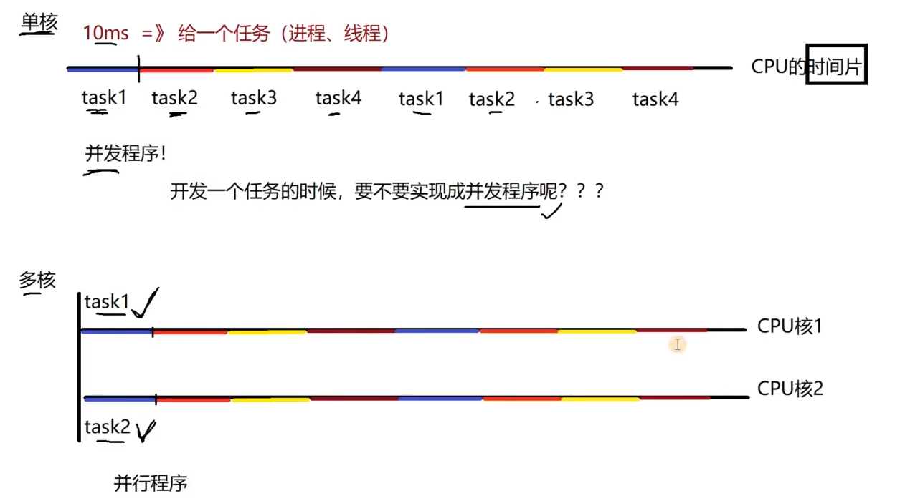
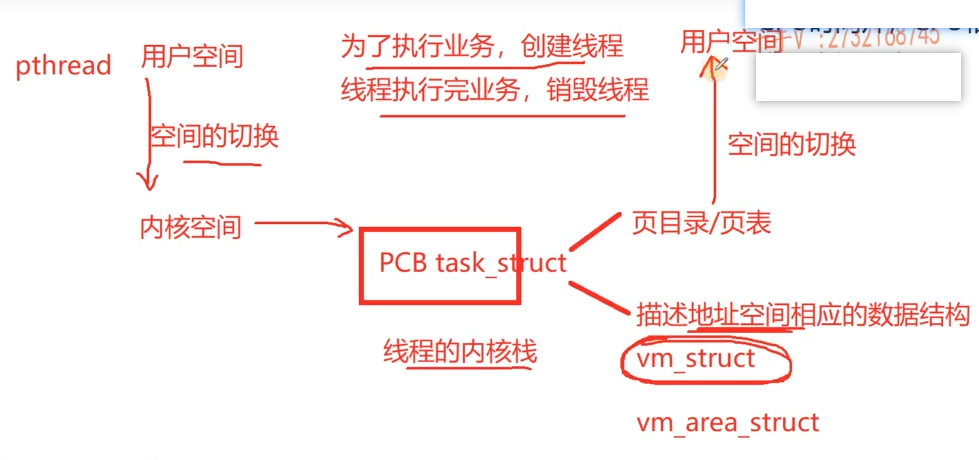
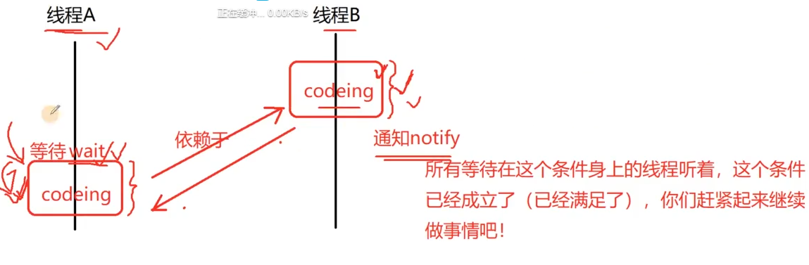
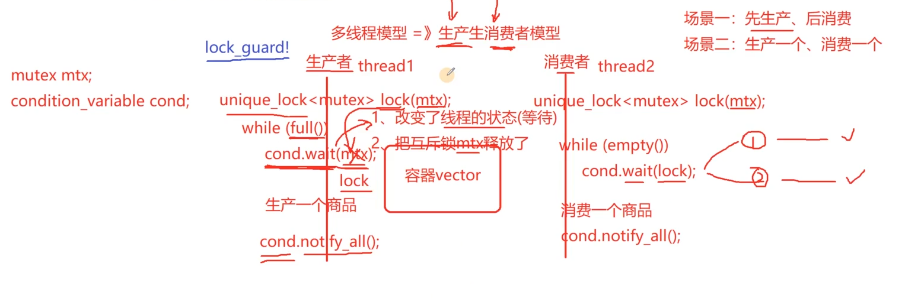

# 线程池项目 

五大池：
内存池，连接池，进程池，**线程池**，协程池


## 线程池需要的基础知识：

### 1. 并发与并行

CPU是会瞬间切换，执行不同任务的，这看起来像是CPU一瞬间一块执行的，实际上是通过切换上下文实现，这种叫并发

而CPU多核中，才能实现一瞬间执行多个任务，这个才叫并行

下图可视化表示：



并发的单位是单核CPU，而并行的单位是多核，是同一时间同时调度

### 2. IO密集型、CPU密集型

#### IO密集型

（程序里指令的执行，涉及IO操作，比如设备、文件、网络操作（等待客户端连接））

（IO是可以把程序阻塞住的，此时再分类给这样程序的CPU时间片，CPU相当于空闲下来了）


#### CPU密集型

（程序里面的指令都是做计算用的）


#### 多线程程序一定就好吗？

对于多核，IO密集型和CPU密集型的任务中，多线程都是有必要的，就像muduo中，把IO线程和工作线程分开就可以了

对于单核，IO密集型，更适合设计成多线程程序，可以避免阻塞带来的资源浪费，而CPU密集型的程序就不适合了，它本身不阻塞，如果计算任务比较复杂，那占用CPU时间就会更长，线程来回切换带来的优势就不明显，甚至会造成资源浪费

例如：

假如只有一个计算器(单核CPU)，需要计算1到1亿的和，有两种方式：

* 一个线程一直计算
* 多个线程，每个线程算一段

注意只有一个计算器，当有一个线程在计算的时候，其他线程是无法操作的

显而易见多线程更麻烦，会比单线程更慢（因为线程的调度有额外花费：线程的上下文切换(线程调度完了，该调度下一个线程)）


### 3. 线程的消耗

为了完成任务，创建多少线程是最好的？？越多越好？

* **线程的创建和销毁都是非常“重”的操作**

创建线程时。有空间的切换，有用户空间切换到内核空间，消耗如下：

 

正是由于动态创建线程和销毁线程的开销非常大，因此要提前建立线程池，这也是线程池存在的理由


* **线程栈本身占用大量内存**

每个线程都有独立栈空间（默认约 8MB），线程数量一多会造成巨大的内存开销；如果栈空间耗尽会导致栈溢出（stack overflow），程序崩溃。因此在高并发系统中通常通过减少线程数量、缩小栈大小以及避免大对象和深递归来优化。


* **线程的上下文切换要占用大量时间**

线程调度需要进行上下文切换，而上下文切换不仅涉及用户态与内核态的切换，还会导致CPU缓存失效和流水线中断，因此其开销较大。在高并发场景下，如果线程数量远大于CPU核心数，会导致频繁的上下文切换，使CPU大量时间消耗在调度而非实际计算上，从而降低整体CPU利用率。


* **大量线程同时唤醒会使系统经常出现锯齿状负载或者瞬间负载量很大导致宕机**

当大量线程同时被唤醒去竞争同一资源时，只有少数线程能够成功执行，导致CPU瞬间负载飙升、上下文切换频繁，从而形成锯齿状负载。高性能服务器通常通过**事件驱动模型**（**epoll+Reactor**）来避免该问题。

传统多线程模型中，多个线程会同时等待和竞争资源，容易产生惊群效应和大量上下文切换。而基于**epoll的Reactor模型**通过事件驱动机制，只在文件描述符真正就绪时通知对应线程处理事件，从而**避免无效唤醒**。同时，**一个线程可以管理大量连接**，显著**减少线程数量和上下文切换开销**。在muduo中，通过one loop per thread模型将连接绑定到固定线程，进一步避免线程竞争和锁开销，从而实现高效稳定的高并发处理。


那多少线程最好呢？

像muduo，libevent 等网络库中：

**一般按照当前CPU的核心数量来确定**


### 4. 线程池的类型

* fixed 模式

线程数量是固定的，个数由当前CPU的核心数量来确定

* cached 模式

线程的个数可以动态增长和销毁


### 5. 线程同步

（处理线程能不能进来？确保一次只能进来一个的问题）

同步是为了解决多线程环境下的**数据竞争**和**时序依赖**问题。

#### （一）线程互斥 (Mutual Exclusion)

用于保护“共享资源”，确保同一时刻只有一个线程访问。

1.  **std::atomic<T> (原子类型)**
    *   **原理**：硬件层面的 CAS 指令，无锁（Lock-free）。
    *   **优点**：性能极高，不会引起内核态切换。
    *   **适用**：计数器、布尔标记位。

2.  **std::mutex (互斥锁)**
    *   **原理**：操作系统提供的阻塞机制。
    *   **智能锁 (RAII)**：
        *   `std::lock_guard`：轻量级，构造加锁，析构解锁。不支持手动解锁，不可用于条件变量。
        *   `std::unique_lock`：功能强大，支持手动 `unlock()`，是配合**条件变量**的唯一选择。

3. 一个程序能不能在多线程环境下执行？？？
   * 看这段代码是否存在**竞态条件**

4. 竞态条件是什么?
   * 代码片段在**多线程环境下**执行，随着线程的调度**顺序不同**，而得到**不同的运行结果**
   * 存在竞态条件的代码片段叫做：临界区代码段 --》保证它的**原子操作**

5. 如果在多线程环境下，是不存在竞态条件的，那就称作**可重入的**（代码在没运行完之后又运行了）

6. 如果存在竞态条件，那就是不可重入的。那就需要进行原子操作，需要用到线程互斥

   *   **竞态条件 (Race Condition)**：程序执行结果取决于线程调度顺序。

   *   **临界区 (Critical Section)**：存在竞态条件的代码段，必须保证操作的原子性。

   *   **可重入性 (Reentrancy)**：函数在被多个线程并发调用时，其执行结果是符合预期的（通常是因为不使用全局/静态变量）。


#### （二）线程通信 

（不同线程的不同代码块，一个代码块的执行，依赖另一种线程代码块的结果，才能执行，如`wait`有依赖其他线程的`notify`)

线程通信用于协调线程间的**先后执行顺序**（例如：任务队列R没任务时，线程应该等待；有任务时，通知线程处理）。

##### 1. 条件变量 (std::condition_variable)

* Linux系统pthread
* C++11 thread

这是 C++ 中最常用的线程通信机制。单独无法使用，它必须配合 `std::unique_lock<std::mutex>` 使用。

* **核心操作**：

  *   `wait(lock, predicate)`：释放锁并阻塞当前线程。直到被通知**且**谓词（predicate）为真时才返回并重新拿锁。
  *   `notify_one()`：唤醒一个正在等待该条件的线程（如：有一个新任务入队）。
  *   `notify_all()`：唤醒所有等待的线程（如：线程池准备关闭，通知所有线程退出）。

* **为什么需要 predicate (Lambda 表达式)？**

  *   解决**虚假唤醒 (Spurious Wakeup)**：线程可能在没有被通知的情况下被操作系统唤醒，因此需要循环检查条件是否真的满足。

* **应用预演**：

  ```cpp
  // 消费者线程（取任务）
  std::unique_lock<std::mutex> lock(queue_mtx);
  cv.wait(lock, []{ return !task_queue.empty() || !is_running; });
  // 处理任务...
  ```



应用场景：生产消费模型

（只有生产出来，才能消费）



##### 2. 信号量 (std::semaphore) - C++20 引入

信号量可以看作资源计数没有限制的mutex互斥锁

mutex互斥锁计数只能是0或者1

mutex.lock() 锁的资源计数 0—>1

coding...

mutex.unlock() 锁的资源计数 1—>0


信号量是一个计数器，用于控制同时访问特定资源的线程数量。

*   **类型**：
    *   `std::binary_semaphore`：二值信号量（等同于互斥锁，但可跨线程释放）。
    *   `std::counting_semaphore<N>`：计数信号量。
*   **核心操作**：
    *   `acquire()`：计数器减 1。如果计数器为 0，则阻塞。
    *   `release()`：计数器加 1，并唤醒阻塞的线程。
*   **与条件变量的区别**：
    *   信号量是有“状态”的（内部有计数）。即使先发送信号（release）后等待（acquire），也不会丢失信号。
    *   条件变量是“即时”的。如果没有线程在 wait，notify 信号就会丢失。

##### 3. Future & Promise (异步通信)

用于**获取另一个线程的执行结果**。

*   `std::promise<T>`：由发送端设置结果。
*   `std::future<T>`：由接收端获取结果。
*   **特点**：一次性的通信。一旦结果产生，通道就失效。
*   **适用场景**：线程池提交任务后，主线程想获取该任务的返回值。

---

### 总结：线程同步工具的选择建议

| 需求                            | 推荐工具                             |
| :------------------------------ | :----------------------------------- |
| 简单的数值自增/标记             | `std::atomic`                        |
| 保护共享数据结构 (如 `queue`)   | `std::mutex` + `std::lock_guard`     |
| 协调线程先后顺序 (如“任务来了”) | `std::condition_variable`            |
| 限制并发访问资源的数量          | `std::semaphore` (C++20)             |
| 获取异步任务的返回值            | `std::future` / `std::packaged_task` |

---

### 补充：线程池中的通信逻辑预演

1.  **任务入队**：
    *   开发者调用 `enqueue()`。
    *   加锁 -> 任务放入 `std::queue` -> 释放锁。
    *   调用 `cv.notify_one()` 通知空闲线程。
2.  **任务出队**：
    *   线程在 `cv.wait()` 处阻塞。
    *   被通知后，竞争获取锁。
    *   从 `std::queue` 取出任务。
    *   释放锁 -> 执行任务。
3.  **优雅退出**：
    *   设置 `is_running = false`。
    *   调用 `cv.notify_all()` 唤醒所有阻塞线


 

