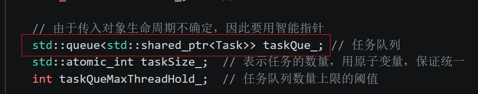
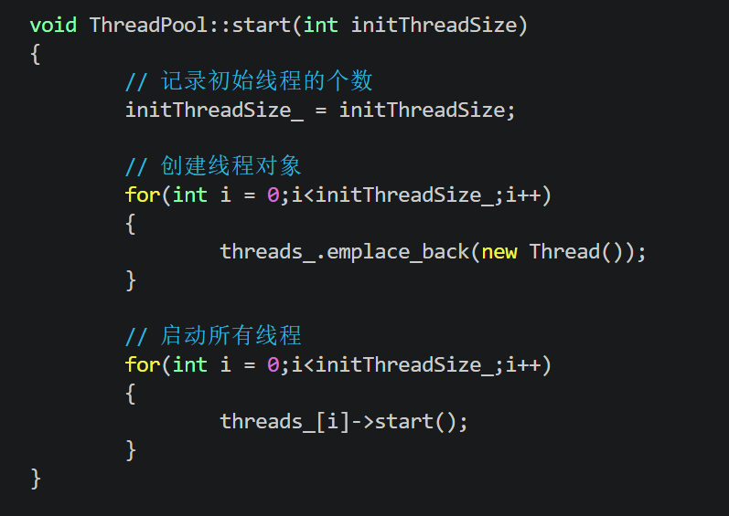
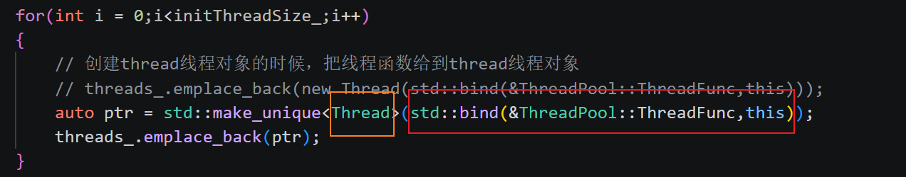

# 代码框架

ThreadPool 线程池，它只是一个库，提供接口，而不是独立运行的项目

### 希望提供的接口（API）如下：

```cpp
# 创建方式
ThreadPool pool;
pool.setMode(fix(default)|cached);
pool.start();
```

```cpp
# 提交任务对象
pool.submitTask(concreateTask);

# 提交任务对象并返回结果
Result result = pool.submitTask(concreateTask);
```

Result 的类型每个人的需求可能不同，因此要适应各种类型，这里使用C++17的any类型

  `result.get().Cast<结果类型>()`


---

### 1. 详细解释 `Task` 类

```cpp
class Task {
public:
    virtual void run() = 0; 
};
```

这是一个**抽象基类**（Abstract Base Class）。

*   **`virtual`**：关键字，表示这是一个虚函数。
*   **`void run() = 0`**：这被称为**纯虚函数**（Pure Virtual Function）。
    
    *   包含纯虚函数的类叫做**抽象类**，不能被实例化（你不能 `Task t;` 这样写）。
    *   **设计目的**：它定义了一个**接口规范**。线程池不知道具体要执行什么逻辑（是下载文件？还是计算数学题？），所以它定义一个 `Task` 基类，要求用户必须继承这个类并实现 `run` 方法。
*   **如何使用**：
    ```cpp
    class MyTask : public Task {
    public:
        void run() override {
            // 在这里写具体的业务逻辑
            std::cout << "正在处理我的任务..." << std::endl;
        }
    };
    // 放入线程池
    pool.submit(std::make_shared<MyTask>());
    ```

---

### 2. 其他关键内容详细解释

为了实现一个健壮的线程池，代码中使用了许多并发编程的核心组件：

#### (1) `std::shared_ptr<Task>` (智能指针)
*   **为什么用**：任务对象是由用户创建并交给线程池的。如果用户创建的任务在执行前就被释放了，程序会崩溃。
*   **作用**：`shared_ptr` 自动管理内存。只要任务还在队列中，或者正在被线程执行，引用计数就不为0，对象就不会被销毁，有效防止内存泄漏和野指针。

#### (2) `std::atomic_int taskSize_` (原子变量)
*   **为什么用**：多个线程（用户线程添加任务，线程池线程取走任务）会同时修改 `taskSize_`。
*   **作用**：普通的 `int` 自增或自减（`++` / `--`）不是原子的（分为读、改、写三步）。`std::atomic` 保证了操作的原子性，不需要加锁也能保证多线程下的计数准确，性能更高。

#### (3) `std::mutex taskQueMtx_` (互斥锁)
*   **作用**：保证**队列（std::queue）的线程安全**。`std::queue` 本身不是线程安全的。如果两个线程同时向队列 push 或 pop，会导致内部数据结构破坏。在操作队列前必须 `lock`，操作完 `unlock`。

#### (4) `std::condition_variable` (条件变量)
这是线程间同步的高级工具。代码中有两个：
*   **`notFull_` (不满)**：
    *   **场景**：当任务队列达到上限 `taskQueMaxThreadHold_` 时，用户线程想继续投递任务。
    *   **动作**：用户线程会阻塞在 `notFull_` 上等待，直到线程池取走一个任务，空出位置。
*   **`notEmpty_` (不空)**：
    *   **场景**：当队列中没有任务时，线程池里的工作线程在干什么？
    *   **动作**：工作线程会阻塞在 `notEmpty_` 上，不消耗 CPU。直到用户投递了新任务，调用 `notEmpty_.notify_all()`，线程才会被唤醒去干活。

#### (5) `std::vector<Thread*>`
*   **作用**：管理线程池创建的所有线程对象。在析构时，需要遍历这个列表，确保所有线程都正确停止并回收资源。


###  3. 为什么任务队列要用智能指针?



---

#### 1. 为什么不用原生指针（Raw Pointer）？

虽然 `std::queue<Task*>` 可以解决多态问题，但会带来严重的内存管理隐患：

1.  **所有权不明确**：任务由用户创建并丢进线程池。谁负责 `delete` 这个指针？
    *   如果线程池负责 `delete`，用户必须保证任务是 `new` 出来的，不能传栈对象的地址。
    *   如果用户负责 `delete`，用户根本不知道线程池什么时候执行完任务。
2.  **生命周期错位（悬空指针/野指针）**：
    线程池是**异步**执行的。可能用户提交了任务后，由于作用域结束或手动释放，原对象已被销毁，而此时线程池里的工作线程正准备执行该任务，程序会直接崩溃。

---

#### 2. 为什么选择智能指针？（核心重点）

代码中使用了 `std::shared_ptr<Task>`，这是目前设计线程池的通用做法，主要解决以下问题：

##### A. 自动资源管理（RAII）

`std::shared_ptr` 内部维护一个引用计数。当任务进入队列时，计数加 1；当任务执行完毕并从队列（或执行函数）中移除时，计数减 1。当计数清零时，系统自动释放内存，彻底解决内存泄漏问题。

##### B. 保证异步执行的安全性

*   **延长生命周期**：即使外部提交任务的代码块已经结束了（局部变量销毁），只要 `std::queue` 还持有这个 `shared_ptr`，任务对象就一定存在。
*   **多线程共享安全**：多个线程可能同时操作任务对象（例如：线程池正在执行任务，同时另一个监控线程在统计任务状态），`shared_ptr` 保证了只要还有人在引用，对象就不会被析构。

---

#### 5. 结合代码的总结脑图

| 维度         | 关键点               | 原因/后果                                                    |
| :----------- | :------------------- | :----------------------------------------------------------- |
| **类型层面** | 基类 `Task` 是抽象类 | 必须用指针实现多态调用 `run()`，否则编译失败。               |
| **内存层面** | 异步解耦             | 生产者（用户）和消费者（线程池）生命周期不一致，原生指针易导致野指针。 |
| **安全层面** | 引用计数             | `shared_ptr` 确保任务在执行完之前不会被外部意外销毁。        |
| **语法层面** | 容器存储             | `std::queue` 存储智能指针能实现自动 `delete`，符合现代 C++ 风格。 |


### 4. 增加限制

对于线程池来说，我不希望对线程池本身进行拷贝构造和赋值，因此添加

```cpp
ThreadPool(const ThreadPool&) = delete;
ThreadPool& operator=(const ThreadPool&) = delete;
```

#### 1. 为什么要禁止拷贝？

##### A. 资源所有权的唯一性
`ThreadPool` 内部包含了 `std::vector<Thread*>`、`std::mutex` 和 `std::condition_variable`。

*   **锁和条件变量不可拷贝**：C++ 标准库中的 `std::mutex` 和 `std::condition_variable` 的拷贝构造函数本身就是 `delete` 的。如果你的类允许拷贝，编译器会因为无法拷贝这些成员而报错。
*   **线程的管理权**：如果允许拷贝，那么拷贝出来的第二个线程池是否应该管理同一批线程？如果是，两个池同时析构时会发生“双重释放（Double Free）”；如果不是，拷贝这些线程状态也没有意义。

##### B. 逻辑歧义
线程池是一个“管理者”角色。如果你写出 `ThreadPool pool2 = pool1;` 这样的代码，逻辑上很难定义 `pool2` 应该是什么状态：
*   它是共用同一个任务队列吗？
*   它要重新开启一批新线程吗？
*   还是仅仅复制配置？
为了消除这种逻辑歧义，**禁止拷贝是代价最小、最清晰的方案**。

---

#### 2. 现代 C++ 的标准写法

```cpp
class ThreadPool {
public:
    ThreadPool();
    ~ThreadPool();

    // 禁止拷贝构造和赋值
    ThreadPool(const ThreadPool&) = delete;
    ThreadPool& operator=(const ThreadPool&) = delete;

    // (可选) 同样可以考虑禁止移动语义，除非你有特殊需求
    ThreadPool(ThreadPool&&) = delete;
    ThreadPool& operator=(ThreadPool&&) = delete;

    // ... 其他成员函数 ...
};
```


#### 3. 是否需要支持移动（Move）？

虽然拷贝必须禁止，但有时我们需要**移动语义**（Move Semantics）。

*   **如果禁止移动**（如上所示）：这个线程池对象就只能在创建它的地方存在，或者通过指针传递。这是最稳妥的做法，因为线程池生命周期通常贯穿整个程序。
*   **如果支持移动**：你可以把线程池作为函数的返回值。但这要求你小心处理 `std::vector<Thread*>` 的所有权转移，以及确保在移动过程中没有线程正在运行，实现起来非常复杂。

**结论**：对于线程池而言，**既禁止拷贝也禁止移动**是最常见的做法。


### 5. 写出线程池启动函数



#### 1. 为什么使用 `emplace_back` 而不是 `push_back`？

虽然在这里 `threads_` 存储的是指针（`Thread*`），`emplace_back` 和 `push_back` 的性能差异微乎其微，但使用 `emplace_back` 是一种**现代 C++ 的最佳实践**：

*   **原地构造**：`push_back` 通常会创建一个临时对象再将其拷贝/移动到容器中。而 `emplace_back` 直接在容器管理的内存空间内构造对象。
*   **语义一致性**：如果未来你将 `vector<Thread*>` 改为 `vector<std::unique_ptr<Thread>>`，`emplace_back` 可以直接接受 `new` 出来的指针并构造智能指针，而 `push_back` 则需要更复杂的写法。
*   **对于指针类型**：对于 `vector<Thread*>`，`emplace_back(new Thread())` 避免了手动创建一个指针变量再传入的过程。

---

#### 2. 为什么存储 `Thread*` 指针而不是 `Thread` 对象？

在 `std::vector<Thread> threads_` 中直接存储对象会有以下风险：

*   **禁止拷贝/移动**：底层的线程对象（如 `std::thread`）通常是禁止拷贝的。如果 `Thread` 类内部封装了 `std::thread`，那么在 `vector` 扩容（Reallocate）时，会导致旧对象的销毁和新对象的创建，这会破坏线程状态。
*   **地址稳定性**：存储指针可以确保每一个 `Thread` 对象的**内存地址在整个生命周期内保持不变**。如果存储对象，`vector` 的扩容会导致对象频繁搬移，这对于已经启动并在运行中的线程来说是致命的。
*   **多态支持**：虽然这里用的是 `Thread`，但如果未来有不同的线程类型，指针可以支持多态。

---

#### 3. “创建”与“启动”为什么要分两个循环？

代码中先用一个循环创建所有 `Thread` 对象，再用第二个循环调用 `start()`。这种**“两步走”**的设计非常关键：

*   **避免竞态条件（Race Condition）**：
    如果在一个循环里“创建即启动”，可能会出现：第一个线程已经开始运行并尝试访问 `threads_` 列表或线程池的其他成员，而此时 `ThreadPool` 还没完成所有线程对象的初始化。
*   **确保环境就绪**：
    在启动任何一个执行流之前，先确保线程池内部所有的管理对象（所有线程实例）都已经分配好内存并处于稳定状态。这保证了当第一个线程回头看线程池时，看到的资源是完整的。


## 调整代码细节

### 一、 为什么线程函数定义在 ThreadPool 且使用 `std::bind`？



#### 1. 职责划分（解耦）
*   **Thread 类**：它是一个**通用的工具类**。它的唯一任务就是“创建一个系统线程并运行一个函数”。它不关心这个函数是做什么的（是算质数、读文件，还是从队列取任务）。
*   **ThreadPool 类**：它是一个**业务逻辑类**。它知道任务队列在哪里、有多少任务、什么时候需要加锁。
*   **如果不定义在 ThreadPool**：如果把逻辑写在 `Thread` 里，`Thread` 就必须持有一个 `ThreadPool` 的指针才能访问任务队列。这会导致 `Thread` 类只能给线程池用，失去了通用性。

#### 2. 访问权限
`threadFunc` 需要访问 `ThreadPool` 的私有成员（如 `taskQue_`, `taskQueMtx_`）。作为 `ThreadPool` 的成员函数，它天然拥有访问权限。

#### 3. `std::bind` 的作用
`threadFunc` 是一个**非静态成员函数**，它隐含了一个 `this` 指针参数。

*   `std::thread` 构造函数需要一个**独立的可调用对象**。
*   `std::bind(&ThreadPool::threadFunc, this)` 的含义是：将 `ThreadPool` 类的成员函数与当前的 `this` 实例绑定，变成一个**不需要参数就能调用的闭包**，交给 `Thread` 类去执行

---

### 二、 语法细节解析

#### 1. `std::function` 与 `using`
```cpp
// 在 Thread 类定义中
using ThreadFunc = std::function<void()>;
private:
    ThreadFunc func_;
```
*   **`std::function<void()>`**：这是一个函数包装器（模板）。它代表“任何**没有参数**且**返回类型为 void** 的可调用对象”（包括普通函数、Lambda 表达式、`bind` 后的成员函数等）。
*   **`using`**：给这个复杂的模板类型起个别名 `ThreadFunc`，提高代码可读性。
*   **`func_`**：`Thread` 类内部保存了这个“锦囊”（回调函数），以便在真正启动线程时调用。

#### 2. `std::thread` 与 `detach()`
```cpp
void Thread::start() {
    std::thread t(func_); // 创建并运行线程
    t.detach();           // 分离线程
}
```
*   **`std::thread t(func_)`**：这一行会调用系统 API 真正创建一个内核线程。新线程一出生，就会立刻去执行 `func_`（即绑定的 `threadFunc`）。
*   **`t.detach()`**：
    *   **生命周期解耦**：在 C++ 中，`std::thread` 对象 `t` 是一个局部变量（管理句柄）。如果函数 `start()` 结束了，`t` 被销毁，但它代表的底层线程还在运行，程序会触发 `std::terminate()` 崩溃。
    *   **作用**：`detach` 将管理句柄 `t` 与底层真正的线程分离。分离后，即使 `t` 销毁了，底层线程也会继续独立运行直到完成。
    *   *注意*：在生产环境下，通常会使用 `join()` 或在析构时妥善处理，但在简单的线程池设计中，`detach` 是一种让线程“自生自灭”处理业务的简便方法。

---

### 三、 线程执行流程全梳理（逻辑链）

1.  **用户调用 `ThreadPool::start()`**：
    
    *   `ThreadPool` 决定启动一批线程。
    
2.  **创建回调锦囊**：
    *   通过 `std::bind(&ThreadPool::threadFunc, this)`，`ThreadPool` 把“**谁来执行** (this)”和“**执行什么** (threadFunc)”打包。
    
3.  **实例化 `Thread` 工具类**：
    
    *   `new Thread(锦囊)` 被执行。此时，`Thread` 对象内部的 `func_` 存下了这个锦囊，但**此时线程还没真正创建**。
    
4.  **启动线程 `threads_[i]->start()`**：
    
    *   调用 `Thread::start()`。
    *   内部执行 `std::thread t(func_)`。此时，操作系统正式创建一个执行流。
    
5.  **回调触发**：
    *   新线程开始运行。它运行的是 `func_`，而 `func_` 指向的就是 `ThreadPool::threadFunc`。
    *   **回调函数体现**：`threadFunc` 就是一个**回调函数**。它由 `ThreadPool` 定义，却是在 `Thread` 类创建的子线程中被调用的。
    
6.  **进入工作循环**：
    * 子线程进入 `threadFunc` 内部。在实际实现中，这里会有一个 `while(true)` 循环，不断从 `ThreadPool` 的任务队列里取任务并 `run()`。
    
      

### 四、从原始指针到 `std::unique_ptr` 的容器管理优化

#### 1. 核心背景：为什么要改用 `unique_ptr`？

*   **原始指针 (`Thread*`) 的痛点**：必须手动在析构函数中遍历 `vector` 并 `delete` 每个指针，否则会导致内存泄漏。如果线程创建过程中发生异常，手动管理极其麻烦。
*   **`unique_ptr` 的优势**：符合 **RAII** 思想。当 `vector` 被销毁或清空时，它所包含的 `unique_ptr` 会自动调用析构函数，进而安全地释放 `Thread` 对象，无需手动干预。

---

#### 2. 核心矛盾：唯一性与所有权转移

`std::unique_ptr` 的设计初衷是**独占所有权**。

*   **禁止拷贝**：`unique_ptr` 禁用了拷贝构造函数和拷贝赋值运算符。
*   **允许移动**：它只允许通过移动构造来转移所有权。

##### 为什么 `threads_.emplace_back(ptr)` 会报错？

当你写出如下代码时：

```cpp
auto ptr = std::make_unique<Thread>(...); // ptr 是一个具名的局部变量，它是【左值】
threads_.emplace_back(ptr);              // 尝试将 ptr 放入 vector
```

**原因分析：**

1.  `ptr` 是一个**左值**，因为它有名字，可以获取它的地址。
2.  `vector::emplace_back` 接收到左值时，会尝试调用 `std::unique_ptr` 的**拷贝构造函数**。
3.  但 `unique_ptr` 的拷贝构造函数是 `delete` 的。编译器报错：“试图引用已删除的函数”。

---

#### 3. 解决方案：显式所有权转移

##### 使用 `std::move`（针对具名变量）

如果已经创建了变量 `ptr`，必须通过 `std::move` 将其显式转换为**右值**，从而触发**移动构造函数**：

```cpp
auto ptr = std::make_unique<Thread>(std::bind(&ThreadPool::ThreadFunc, this));
threads_.emplace_back(std::move(ptr)); 
// 此时，ptr 变为空，所有权正式转移到了 vector 内部
```

##### 方案 B：直接传入匿名对象（最推荐）

如果不打算在外部使用 `ptr`，直接在参数位创建。匿名对象本身就是右值（严格说是纯右值 prvalue）：

```cpp
threads_.emplace_back(std::make_unique<Thread>(std::bind(&ThreadPool::ThreadFunc, this)));
```

这种写法最简洁，不涉及具名变量的转换。

---

#### 4. 深入理解 `emplace_back` 与 `push_back`

在使用 `unique_ptr` 时，这两者在语义上略有区别，但都需要右值：

1.  **`push_back(std::move(ptr))`**: 
    *   先构造好 `unique_ptr`，再通过移动构造函数将其移动到容器末尾。
2.  **`emplace_back(...)`**: 
    *   **原本用途**：在容器空间内直接就地构造元素，避免额外的拷贝或移动。
    *   **在 `unique_ptr` 中的表现**：由于 `unique_ptr` 构造函数是 `explicit` 的，`emplace_back` 的写法（如 `threads_.emplace_back(new Thread(...))`）在技术上可行，因为它内部通过完美转发直接调用构造函数。
    *   **最佳实践建议**：即便使用 `emplace_back`，也建议配合 `std::make_unique`。

---

#### 5. 总结笔记：避坑指南

| 场景         | 代码写法                                          | 是否正确       | 原因                       |
| :----------- | :------------------------------------------------ | :------------- | :------------------------- |
| **原始指针** | `threads_.push_back(new Thread(...))`             | ✅ 运行正确     | 逻辑简单，但有内存泄漏风险 |
| **左值拷贝** | `auto p = ...; threads_.push_back(p);`            | ❌ **编译失败** | `unique_ptr` 不能拷贝      |
| **右值移动** | `auto p = ...; threads_.push_back(std::move(p));` | ✅ **推荐**     | 显式所有权转移             |
| **直接构造** | `threads_.emplace_back(std::make_unique<T>(...))` | ✅ **最推荐**   | 代码简洁，无多余变量       |

##### 知识点回顾：

1.  **非拷贝性**：`std::unique_ptr` 是不可拷贝的，只能移动。
2.  **左值 vs 右值**：有名字的变量是左值，不能直接转移所有权；临时对象/显式 `move` 是右值，可以转移。
3.  **容器的所有权**：当 `unique_ptr` 进入 `vector` 后，`vector` 成了该对象的“新主人”。


# C++语法糖

## 1. enum class

### (1) 什么是 `enum`？

`enum` 是 **枚举（Enumeration）** 的缩写。它是一种用户自定义的数据类型，用于为一组整数常量定义有意义的名字，使代码更具可读性。

### (2) C++11的enum特点

#### A. 强作用域（避免命名冲突）
枚举成员被封装在枚举名的作用域内，必须通过 `::` 访问。
```cpp
enum class Color { Red, Green, Blue };
enum class TrafficLight { Red, Yellow, Green }; // 完美运行，不会冲突

Color c = Color::Red; 
```

#### B. 强类型检查（防止隐式转换）
`enum class` 不会自动转换为 `int`。如果你尝试将它与整数比较或赋值给整数，编译器会报错。

```cpp
Color c = Color::Red;

// if (c == 0) { }        // 编译错误！无法直接比较
if (c == Color::Red) { }   // 正确

// 如果非要转，必须显式转换：
int val = static_cast<int>(c); 
```

### (3) 线程池里的应用

#### 代码中的用法：

```cpp
enum class PoolMode {
    MODE_FIXED,   // 固定数量的线程
    MODE_CACHED,  // 线程数量可动态增长
};
```


## 2. 虚函数

### （1) 虚函数的基本概念

**虚函数（Virtual Function）** 是 C++ 等面向对象编程（OOP）语言中实现**多态（Polymorphism）**的核心机制。它允许在派生类中重写基类的方法，并确保通过基类指针或引用调用该函数时，能够执行“正确”的对象版本（即实际指向的对象的版本）。

在**基类中**，使用**关键字 `virtual` 声明**的**成员函数称**为虚函数。

```cpp
// 定义基类
class Animal {
public:
    // 定义虚函数
    virtual void speak() {
        cout << "Animal makes a sound" << endl;
    }
    // 定义纯虚函数
    virtual void speak() = 0;
};

// 定义派生类（子类）
class Dog : public Animal {
public:
    void speak() override { // override 可选，但建议加上，表示重写
        cout << "Dog barks" << endl;
    }
};
```

### （2）虚函数的核心特点

#### A. 动态绑定（Dynamic Binding）
这是虚函数最重要的特性。

*   **静态绑定**：在编译阶段就确定了要调用哪个函数（普通函数）。
*   **动态绑定**：在程序运行阶段，根据对象的**实际类型**来决定调用哪个函数。通过基类指针或引用调用虚函数时，会触发动态绑定。

#### B. 传递性
如果基类中某个函数被声明为 `virtual`，那么在所有的派生类中，该函数自动成为虚函数（无论是否显式写了 `virtual`）。

#### C. 存在于类中
只有**类的成员函数才能是虚函数**；全局函数或静态成员函数不能是虚函数。

#### D. 纯虚函数不能被实例化

包含**纯虚函数**的类叫做**抽象类**，不能被实例化（你不能 `Task t;` 这样写）。


### （3）虚函数的作用

在 OOP 中，我们经常需要处理“一组”相关的对象。虚函数实现了**“接口一致，行为多样”**。

（用线程池举例）

**设计目的**：它定义了一个**接口规范**。线程池不知道具体要执行什么逻辑（是下载文件？还是计算数学题？），所以它定义一个 `Task` 基类，要求用户必须继承这个类并实现 `run` 方法。

### （4） 虚函数的底层实现机制：虚表（vtable）

C++ 编译器通常使用 **虚函数表（vtable）** 和 **虚表指针（vptr）** 来实现虚函数。

1.  **虚表 (vtable)**：编译器为每一个拥有虚函数的类创建一个表。这个表是一个函数指针数组，存储着该类所有虚函数的地址。
2.  **虚表指针 (vptr)**：每个包含虚函数的类的实例化对象，其内存结构的头部（或尾部）都会隐藏一个指针，指向该类的 vtable。
3.  **调用过程**：
    *   程序运行到 `ptr->speak()` 时。
    *   通过 `ptr` 找到对象的 `vptr`。
    *   通过 `vptr` 找到 `vtable`。
    *   在 `vtable` 中找到对应函数的地址并跳转执行。

**性能代价**：
*   **空间代价**：每个类多一张表，每个对象多一个指针。
*   **时间代价**：调用时增加了一次指针间接寻址的开销。

---

### （5）纯虚函数与抽象类

有时基类无法给出一个有意义的**默认实现**，可以将其定义为**纯虚函数**：

```cpp
class Shape {
public:
    virtual void draw() = 0; // 纯虚函数
};
```
*   ​                                                                                                                                                                                                                                                                                                                                                                                                                                                                                                                      包含纯虚函数的类称为**抽象类（Abstract Class）**。
*   抽象类**不能实例化对象**。
*   派生类必须**实现（重写）纯虚函数**，否则它也将成为抽象类。

---

### （6）虚函数的注意事项（非常重要）

#### ① 虚析构函数
**如果一个类有虚函数，那么它的析构函数也应该是虚的。**

```cpp
class Base {
public:
    virtual ~Base() {} // 必须是虚的
};
```
如果析构函数不是虚的，当你通过 `Base* ptr = new Derived(); delete ptr;` 释放内存时，**只会调用 `Base` 的析构函数**，而**不会调用 `Derived` 的析构函数**，从而导致**内存泄漏**。

#### ② 构造函数不能是虚函数
*   构造函数执行时，对象还没完全创建好，**`vptr` 可能尚未初始化完成**。
*   虚函数的调用依赖于对象类型，而构造函数本身就是为了创建对象的，逻辑上矛盾。

#### ③ 静态成员函数不能是虚函数
**静态成员函数**属于类而不属于对象，**没有 `this`** 指针，无法访问对象的 `vptr`。

#### ④ Inline 函数与虚函数
`inline` 只是给编译器的建议。如果虚函数在运行时才确定调用哪个版本，编译器会忽略 `inline` 请求，将其作为普通虚函数处理。


### （7） 总结

| 特性         | 说明                                          |
| :----------- | :-------------------------------------------- |
| **关键字**   | `virtual` (基类), `override` (派生类建议加上) |
| **目的**     | 实现多态，允许子类定制化行为                  |
| **触发条件** | 通过基类**指针**或**引用**调用虚函数          |
| **核心机制** | vtable (虚函数表) 和 vptr (虚表指针)          |
| **抽象类**   | 含有纯虚函数 `virtual void func() = 0;` 的类  |
| **必做事项** | 具有继承关系的基类析构函数应声明为 `virtual`  |

### （8）为什么触发条件是：通过基类**指针**或**引用**调用虚函数

触发条件必须是指针或引用的原因可以总结为：

1.  **避免拷贝和切割**：确保派生类对象在内存中的完整性（尤其是保留指向子类虚表的 `vptr`）。
2.  **保留间接性**：指针/引用提供了一种间接访问机制，使得编译器在不知道对象具体类型的情况下，能通过对象内部的“指南针”（虚表指针）找到正确的函数地址。

**补充：** 只有通过指针或引用调用虚函数，才会去查虚表（动态绑定）。如果是直接对象调用，编译器会跳过查表过程，直接静态绑定到该对象类型的函数上。

#### 核心原因：对象切割

在 C++ 中，当你把一个派生类对象**直接赋值**给一个基类对象时，会发生**值拷贝**。

```cpp
class Animal { int age; virtual void speak(); };
class Dog : public Animal { int breedId; void speak() override; };

Dog d;
Animal a = d; // 发生了对象切割
```

*   **内存角度**：`Animal` 对象 `a` 只有足够存放 `Animal` 成员的内存空间。当 `d` 赋值给 `a` 时，`d` 独有的成员（如 `breedId`）放不下，会被“切掉”。
*   **虚表指针 (vptr) 角度**：对象 `a` 是一个真正的 `Animal` 实例。它的 `vptr` 指向的是 `Animal` 类的虚表。即使它是从 `Dog` 拷贝过来的，它也**不再是一个 Dog**，而是一个纯粹的 `Animal`。
*   **结果**：`a.speak()` 在编译期就已经确定调用 `Animal::speak`，因为 `a` 的类型在内存里是死死的 `Animal`。

---

#### 指针和引用的本质：保持身份

指针和引用则完全不同。它们**不持有对象本身**，而是**指向/绑定**到对象所在的内存地址。

```cpp
Dog d;
Animal* p = &d; // p 指向 d 的起始地址
Animal& r = d;  // r 是 d 的别名
```

*   **内存角度**：**`p` 只是一个地址**。它所指向的内存块仍然是一个完整的 `Dog` 对象，包含 `age`、`breedId` 以及指向 `Dog` 虚表的 `vptr`。
*   **类型安全**：虽然从编译器的视角看，`p` 的类型是 `Animal*`（限制了你只能调用 `Animal` 拥有的接口），但在运行时，`p` 指向的对象头部那个 `vptr` 依然指向 `Dog` 的虚表。
*   **结果**：当你通过 `p->speak()` 调用时，程序会去 `p` 指向的地址看一眼 `vptr`，发现它指向 `Dog` 的虚表，于是执行了 `Dog::speak`。这就是多态。

---

#### 静态类型 vs 动态类型

这是理解虚函数触发条件的理论框架：

1.  **静态类型 (Static Type)**：变量在代码中声明的类型。编译期确定。
    *   例如 `Animal* p`，静态类型是 `Animal*`。
2.  **动态类型 (Dynamic Type)**：指针或引用实际指向的对象的类型。运行期确定。
    *   例如 `p = new Dog()`，动态类型是 `Dog`。

**多态的本质是：通过静态类型去调用动态类型的行为。**

*   如果你直接用**对象**调用（如 `a.speak()`），静态类型和动态类型永远一致（都是 `Animal`），没有变数，所以不需要虚函数表，编译器直接静态绑定提高效率。
*   如果你用**指针/引用**调用，静态类型（父类）和动态类型（子类）可能不一致，必须依靠 `vptr` 在运行时“探路”。


#### 样例：

#####  为什么任务队列要用指针？(此处为智能指针）


##### 1. 为什么必须用指针？（多态与抽象类）

在代码中，`Task` 是一个带有纯虚函数 `virtual void run() = 0;` 的**抽象基类**。

*   **无法实例化对象**：在 C++ 中，抽象基类不能直接创建对象。因此，`std::queue<Task>` 是无法通过编译的。
*   **避免“对象切片”**：
    如果任务队列存的是值对象（假设 `Task` 不是纯虚的），当你传入一个**派生类对象 `MyTask`** 时，它会**被强制转换成 `Task` 基类对象**，导致**派生类特有的成员变量和虚函数表丢失**。
*   **实现多态**：
    只有通过**指针**或**引用**调用虚函数，程序才能在运行时根据对象的实际类型（动态绑定）去调用派生类重写的 `run()` 方法。


## 3. 模板

如果说**虚函数**是实现**动态多态**（运行时多态）的手段，那么**模板（Template）**就是实现**静态多态**（编译时多态）的核心工具。

模板是 C++ **泛型编程**的基础，它允许我们编写与类型无关的代码。

---

#### 1. 什么是模板？

模板就像是一个**蓝图**或**模具**。它告诉编译器：“我不知道现在要处理什么类型，但无论是什么类型，处理逻辑都是这样的。”

编译器在编译阶段看到你具体使用了什么类型，就会根据这个蓝图“复刻”出一份对应类型的代码。这个过程称为**模板实例化（Template Instantiation）**。

---

#### 2. 模板的分类

##### A. 函数模板 (Function Template)
用于编写参数类型不同、但逻辑相同的函数。

```cpp
// 定义模板
template <typename T> 
T myMax(T a, T b) {
    return (a > b) ? a : b;
}

int main() {
    cout << myMax<int>(3, 7);      // 显式实例化：生成 int 版 myMax
    cout << myMax(3.5, 2.1);      // 自动类型推导：生成 double 版 myMax
    return 0;
}
```

##### B. 类模板 (Class Template)
用于编写成员变量类型不同、但逻辑相同的类（如容器）。

```cpp
template <typename T>
class Stack {
private:
    T data[100];
    int top = -1;
public:
    void push(T val) { data[++top] = val; }
    T pop() { return data[top--]; }
};

Stack<int> intStack;      // 存储整数的栈
Stack<string> strStack;   // 存储字符串的栈
```

---

#### 3. 模板的底层原理：二次编译

模板的代码本身**不会**直接生成二进制指令。

1.  **第一次编译**：编译器检查模板语法是否正确（如括号是否匹配）。
2.  **实例化**：当你在代码中使用 `myMax<int>` 时，编译器会根据模板生成一份真正的 `int` 版函数代码。
3.  **第二次编译**：编译器对生成的具体代码进行编译，检查逻辑是否有错（比如 `T` 类型是否支持 `>` 运算符）。

**结论**：模板之所以快，是因为它在编译期就确定了类型，运行时没有额外开销。

---

#### 4. 模板的进阶特性

##### A. 模板特化
如果某个特定类型需要特殊的处理逻辑，可以使用特化。

*   **全特化**：针对某个具体类型。
    ```cpp
    // 默认模板
    template <typename T> class Compare { ... };
    
    // 专门针对 char* 的特化版（因为指针比较需要用 strcmp）
    template <>
    class Compare<char*> {
        bool isEqual(char* a, char* b) { return strcmp(a, b) == 0; }
    };
    ```
*   **偏特化（部分特化）**：只特化部分参数或类型范围（仅限类模板）。

##### B. 非类型模板参数
模板参数不一定是类型，也可以是常数。

```cpp
template <typename T, int Size>
class Array {
    T data[Size]; // Size 是编译期常量
};

Array<int, 10> arr; // 长度为 10 的 int 数组
```

---

#### 5. 模板 vs 虚函数（多态对比）

这是面试和理解 C++ 设计的核心点：

| 特性           | 模板 (静态多态)          | 虚函数 (动态多态)            |
| :------------- | :----------------------- | :--------------------------- |
| **绑定时间**   | 编译期 (Compile-time)    | 运行期 (Runtime)             |
| **执行速度**   | 快（编译器可优化，内联） | 慢（需要查虚表，无法内联）   |
| **二进制大小** | 可能会导致“代码膨胀”     | 只有一份代码，较小           |
| **灵活性**     | 类型约束强               | 更加灵活，支持异质容器       |
| **典型应用**   | STL 容器、算法           | 插件系统、GUI 框架、业务解耦 |

*   **什么时候用模板？** 当你关心**性能**，且类型在编写代码时就能确定（如 `std::vector`）。
*   **什么时候用虚函数？** 当你需要在**运行中**根据用户输入或外部条件决定对象行为时。

---

#### 6. 模板的优缺点

##### 优点：
1.  **类型安全**：在编译阶段检查类型，比 C 语言的 `void*` 安全得多。
2.  **极致性能**：没有运行时的间接跳转开销。
3.  **高度抽象**：STL（标准模板库）就是基于模板构建的，极大地提高了代码复用。

##### 缺点：
1.  **编译速度慢**：编译器要为每个实例化的类型生成代码。
2.  **错误信息晦涩**：报错信息往往成百上千行，极难调试。
3.  **代码膨胀**：如果实例化了 100 个类型的 `Stack`，二进制文件里就会有 100 份 `Stack` 的代码。
4.  **头文件实现**：模板的实现通常必须写在头文件中（因为编译器在实例化时需要看到完整定义），这会导致头文件巨大且难以实现增量编译。


## 4. 智能指针

在 C++ 中，主流的智能指针有 3 种（都在 `<memory>` 头文件中），外加一个已经废弃的旧版本。

#### 1. `std::unique_ptr`（独占式）

*   **特点**：它是“独霸”的。同一个时刻，只能有一个 `unique_ptr` 指向该对象。
*   **拷贝控制**：**不能被复制**，只能被**移动**（Move）。也就是说，你不能把它的所有权随手传给别人，除非你明确表示“我不要了，给你”（使用 `std::move`）。
*   **性能**：开销几乎为零，和原始指针（raw pointer）一样快。
*   **场景**：正如你代码里的 `Any` 类，它内部管理一个生命周期明确的对象，不需要和别人共享。

#### 2. `std::shared_ptr`（共享式）

*   **特点**：它是“博爱”的。多个 `shared_ptr` 可以指向同一个对象。
*   **原理**：内部维护一个**引用计数**。当一个新的 `shared_ptr` 指向该对象时，计数 +1；当一个指针销毁时，计数 -1。当计数减到 0 时，自动删除对象。
*   **性能**：有一定开销。因为引用计数的增加/减少是原子操作（线程安全），且需要额外的内存存储计数器。
*   **场景**：多个对象需要共同拥有同一个资源，且不确定谁会最后离开（比如复杂的图结构或资源池）。
*   **配套工具**：`std::make_shared`。

#### 3. `std::weak_ptr`（观察者）

*   **特点**：它是 `shared_ptr` 的“旁观者”。它指向由 `shared_ptr` 管理的对象，但**不增加引用计数**。
*   **作用**：
    *   **解决循环引用**：如果两个对象互相用 `shared_ptr` 指向对方，它们永远不会被释放。把其中一个改成 `weak_ptr` 就能打破僵局。
    *   **安全检查**：它不拥有对象，但它可以检查对象是否还活着（通过 `lock()` 尝试转回 `shared_ptr`）。
*   **场景**：缓存系统、观察者模式。


## 5. **右值引用**和**移动语义**

在 C++11 之前，C++ 的性能优化有一个瓶颈：**多余的拷贝**。为了解决这个问题，C++11 引入了**右值引用**和**移动语义**。这是现代 C++（C++11 及以后）最重要的特性之一。

---

### 1. 左值 (lvalue) 与 右值 (rvalue)

简单来说，判断左值还是右值的最快方法是：**看能不能取地址（&）**。

#### A. 左值 (lvalue - locator value)
*   **定义**：**有明确存储地址、有名字的变量。**
*   **特点**：生命周期较长，可以出现在赋值符号的左边或右边。
*   **例子**：变量名、返回引用的函数调用、下标运算 `a[0]`。

#### B. 右值 (rvalue - read value)
*   **定义**：**没有明确存储地址**（或者说是临时的）、通常**没有名字的临时对象**。
*   **特点**：生命周期极短（指令结束即销毁），**只能出现在赋值符号的右边**。
*   **分类**：
    *   **纯右值 (prvalue)**：如字面量 `10`、`true`，非引用返回的临时变量 `a + b`。
    *   **将亡值 (xvalue)**：即将被销毁但能被移动的对象（如 `std::move` 的返回值）。

---

### 2. 左值引用 vs 右值引用

#### A. 左值引用 (`T&`)
只能绑定到左值。
```cpp
int a = 10;
int& refA = a;      // 正确
// int& refB = 10;  // 错误！不能绑定到右值
```
*注：`const T&` 是个例外，它可以绑定到右值。*

#### B. 右值引用 (`T&&`)
只能绑定到右值。
```cpp
int&& ref1 = 10;    // 正确
int a = 10;
// int&& ref2 = a;  // 错误！不能绑定到左值
```
**右值引用的存在意义：** 它标识了这个对象是一个“临时工”，我们可以放心地“偷”走它的资源而不影响别人。

---

### 3. 移动语义 (Move Semantics)

这是核心。想象你有一个巨大的动态数组 `std::vector`。

*   **拷贝（Copy）**：你要把 A 的内容给 B。你需要申请一块新内存，把 A 里的数一个个填进去。
*   **移动（Move）**：你发现 A 反正马上要被销毁了。你直接把 B 的指针指向 A 的内存，然后把 A 的指针置为空。**这只是改了个指针，几乎不耗时。**

#### 移动构造函数与移动赋值
通过右值引用，我们可以重载构造函数：

```cpp
class MyString {
    char* data;
public:
    // 拷贝构造函数（深拷贝）
    MyString(const MyString& other) {
        data = new char[strlen(other.data) + 1];
        strcpy(data, other.data);
    }

    // 移动构造函数（资源转移）
    MyString(MyString&& other) noexcept { 
        data = other.data;  // 直接偷走指针
        other.data = nullptr; // 把对方置空，防止对方析构时释放这块内存
    }
};
```

---

### 4. `std::move` 到底做了什么？

这是一个常见的误区：**`std::move` 并不移动任何东西。**

它的唯一作用是：**强制类型转换**。它把一个左值强制转换为右值引用（`T&&`）。
它就像是在告诉编译器：“这个变量我以后不用了，你可以把它当成临时对象，随便‘偷’它的资源。”

```cpp
string s1 = "hello";
string s2 = std::move(s1); // s1 转换为右值引用，触发 string 的移动构造函数
// 此时 s2 内容为 "hello"，s1 变为空字符串
```

---

### 5. 完美转发 (Perfect Forwarding)

当你写模板函数时，如果你想把参数原封不动地传递给下一个函数（保持它的左值/右值属性），需要用到 `std::forward`。

```cpp
template<typename T>
void wrapper(T&& arg) { // 这里 T&& 叫通用引用/万能引用
    foo(std::forward<T>(arg)); // 原样转发
}
```
*   如果传给 `wrapper` 的是左值，`foo` 接收到的就是左值。
*   如果传给 `wrapper` 的是右值，`foo` 接收到的就是右值。

---

### 6. 为什么需要这些？（总结）

1.  **性能优化**：减少昂贵的深拷贝。对于 `std::vector`、`std::string` 等管理大量内存的对象，性能提升是巨大的。
2.  **独占资源的所有权转移**：有些对象是不允许拷贝的（如 `std::unique_ptr`、线程对象 `std::thread`）。通过移动语义，我们可以把这些对象的所有权从一个地方转到另一个地方。

### 7. 记住一个关键点

**右值引用变量本身是左值！**

```cpp
void func(int&& w) {
    // w 是一个右值引用，但 w 本身有名字，能取地址，所以 w 是左值！
    // 如果你想把 w 继续作为右值传给下一层，必须写 std::move(w)
}
```

### 总结对比

| 概念                | 描述                                                 |
| :------------------ | :--------------------------------------------------- |
| **左值**            | 有名、有址。                                         |
| **右值**            | 无名、临时。                                         |
| **右值引用 (`&&`)** | 专门用来挂载右值的钩子。                             |
| **`std::move`**     | 把左值标记为右值的“说服工具”。                       |
| **移动语义**        | 允许“窃取”临时对象的资源，变“深拷贝”为“浅拷贝指针”。 |


## `push_back` 和 `emplace_back` 的区别


`push_back` 是**将已有的对象压入容器**（可能涉及拷贝或移动），而 `emplace_back` 是**在容器管理的内存空间内直接创建对象**（原地构造）。

---

### 1. 实现机制的区别

#### `push_back` (推入)
当你调用 `v.push_back(obj)` 时：
1. 如果传入的是**左值**，容器会调用**拷贝构造函数**。
2. 如果传入的是**右值**（比如临时对象），容器会调用**移动构造函数**。
3. 如果你传入的是构造函数的参数（如 `v.push_back("hello")`），它会先创建一个临时对象，再把这个临时对象**移动**进容器。

#### `emplace_back` (就地构造)
`emplace_back` 利用了**变长参数模板 (Variadic Templates)** 和 **完美转发 (Perfect Forwarding)**：

1. 它直接接收构造函数所需的参数。
2. 它在容器末尾已经分配好的内存上，直接调用 `placement new` 来构造对象。
3. **完全不产生临时对象**，也不涉及拷贝或移动操作。

---

### 2. 代码对比

假设我们有一个类 `Item`：

```cpp
struct Item {
    int a;
    string b;
    Item(int x, string y) : a(x), b(y) { cout << "Construct\n"; }
    Item(const Item& i) { cout << "Copy\n"; }
    Item(Item&& i) noexcept { cout << "Move\n"; }
};

vector<Item> v;
v.reserve(10); // 预留空间，防止扩容干扰观察
```

#### 情况 A：使用 push_back
```cpp
v.push_back(Item(1, "test")); 
```
**过程：**
1. `Item(1, "test")`：调用构造函数创建一个**临时对象**。
2. `push_back` 接收这个右值，调用**移动构造函数**，在 vector 内存中生成真正的对象。
3. 临时对象析构。
**日志输出：** `Construct` -> `Move` -> (析构临时对象)

#### 情况 B：使用 emplace_back
```cpp
v.emplace_back(1, "test"); 
```
**过程：**
1. 直接把 `1` 和 `"test"` 传给 vector 内部。
2. 在 vector 内存中直接调用构造函数。
**日志输出：** `Construct`

---

### 3. 一个隐蔽的区别：explicit 构造函数

这是很多开发者会忽略的一点：**`emplace_back` 能触发 `explicit` 构造函数，而 `push_back` 不能。**

```cpp
struct Foo {
    explicit Foo(int x) {}
};

vector<Foo> v;

v.push_back(10);      // 编译报错！不能隐式把 int 转为 Foo
v.emplace_back(10);   // 编译通过！这是显式调用构造函数
```

---

### 4. 什么时候用哪一个？

虽然 `emplace_back` 看起来性能更好，但并不是所有时候都要无脑替换。

#### 建议使用 `emplace_back` 的场景：
*   **直接传入构造参数时**（如 `v.emplace_back(1, "a")`）。这是它的主场，省去了临时对象的开销。
*   **对象很大且拷贝/移动成本高时**。

#### 建议使用 `push_back` 的场景：
*   **对象已经存在时**。如果你手里已经有一个对象 `obj`，调用 `v.push_back(obj)` 和 `v.emplace_back(obj)` 效果几乎一样。
*   **为了代码的可读性/安全性**。`emplace_back` 太过强大，有时会不小心调用到你并不想触发的构造函数（比如上面提到的 `explicit` 问题）。
*   **容器存储的是简单内置类型**（如 `int`）。两者性能完全一致，`push_back` 更符合直觉。

---

### 5. 总结

| 特性              | `push_back`              | `emplace_back`           |
| :---------------- | :----------------------- | :----------------------- |
| **引入版本**      | C++98                    | C++11                    |
| **参数**          | 对象的引用（左值或右值） | 构造函数的参数包         |
| **临时对象**      | 可能产生                 | 通常不产生               |
| **构造方式**      | 拷贝构造 或 移动构造     | 原地构造 (Placement New) |
| **explicit 限制** | 严格受限                 | 可以绕过                 |

**一句话建议：** 当你需要**现场构造**一个新对象并放入容器时，用 `emplace_back`；如果你只是想把一个**现成的变量**放进去，用 `push_back`。


