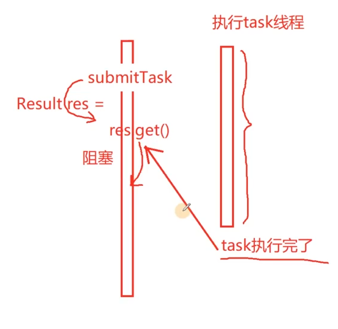

# 异步任务结果（Result 类）设计方案

#### 1. 设计背景与核心痛点

在多线程环境中，任务的**提交者（主线程）**与**执行者（线程池中的工作线程）**是分离的。

*   **非阻塞提交：** 主线程提交任务后应立即返回，不能一直阻塞等待结果，否则无法并行处理其他事务。
*   **延迟获取与阻塞控制：** 虽然提交是非阻塞的，但结果的获取（`.get()`）需要具备智能感知能力：
    *   如果任务已完成：`.get()` 应立即取回数据，实现零等待。
    *   如果任务未完成：`.get()` 才进入阻塞状态，直到任务结束。
*   **最小化阻塞原则：** 为了提高性能，应通过机制通知主线程何时可以获取结果，而不是让主线程过早地进入阻塞等待。

#### 2. 核心组件设计

为了实现上述目标，我们需要构建三个关键组件：

*   **`Any` 类（类型擦除）：**
    *   **作用：** 作为一个通用的包装器，可以接收并存储任何类型的返回值（int, string, 自定义类等）。
    *   **地位：** 它是结果数据的实际载体。

*   **`Semaphore` 类（信号量/同步原语）：**
    *   **作用：** 实现线程间的通信与同步。
    *   **机制：** 当任务完成时，执行线程通过信号量发出“通知”；主线程在调用 `.get()` 时通过信号量进行“等待”。它封装了条件变量（Condition Variable）和互斥锁（Mutex）的复杂逻辑。

*   **`Result` 类（结果集大成者）：**
    *   **作用：** 作为外部交互的唯一接口，解耦任务提交与结果获取。
    *   **成员：** 包含一个 `Any` 对象用于存储值，以及一个 `Semaphore` 对象用于同步。
    *   **核心逻辑：** 
        1.  **存储：** 执行线程结束时，将返回值存入 `Any` 并增加信号量计数。
        2.  **获取：** 用户调用 `.get()` 时，先尝试消耗信号量。若信号量为0则阻塞，若大于0则直接提取 `Any` 中的数据。

#### 3. 完整工作流程

1.  **任务提交：** 用户向线程池提交任务，线程池立即返回一个 `Result` 对象。
2.  **异步执行：** 线程池分配工作线程运行任务，主线程可以继续执行其他逻辑。
3.  **结果写入与通知：**
    *   任务执行完毕，工作线程将返回值封装进 `Result` 对象的 `Any` 成员中。
    *   工作线程调用信号量的 `post()`（或 `notify`），释放信号。
4.  **按需获取：**
    *   主线程在需要数据时调用 `result.get()`。
    *   若此时信号量已释放，主线程将**无感知地、非阻塞地**拿到数据；
    *   若任务仍在运行，主线程在此处**有目的地阻塞**，直至信号到来。





# 首先是处理线程返回值问题

在现有的线程池设计中，要实现“获取任务返回值”功能，提出的问题归纳为以下**三个核心矛盾**：

### 问题一：虚函数与模板的“不兼容”矛盾

这是 C++ 类型系统的基本限制。

*   **当前架构**：我们通过派生 `Task` 类并重写 `virtual void run()` 来实现多态。
*   **困境**：用户需要的返回值类型是千变万化的（可能是 `int`, `string`, 甚至是自定义的结构体）。
*   **技术冲突**：
    *   如果要在 `Task` 基类中定义返回值，由于 C++ **虚函数不能是模板函数**(原因：虚函数需要在编译时确定函数表结构，而模板函数在编译时还没确定具体实例)，我们无法写出类似 `virtual T run()` 这样的代码。
*   我们需要一种方式，既能保持 `Task` 类的多态性，又能让它承载不同类型的返回数据。
*   

### 问题二：异步执行与结果获取的“时差”矛盾

线程池的本质是**异步**。

*   **过程**：调用 `submitTask` 后，任务只是进入了队列，并没有立即执行。
*   **困境**：
    *   如果 `submitTask` 直接等待返回结果，那么调用者必须在原地阻塞等待任务完成，这会让线程池退化为“单线程同步执行”，完全丧失并发意义。
    *   如果 `submitTask` 立即返回（不阻塞），那么此时任务还没执行，返回值还没产生。

### 问题三：结果收集类（Result）的设计挑战（在下一节去实现）

这个 `Result` 类需要承担极其复杂的“桥接”任务，必须解决以下细节：

1.  **线程安全性**：任务是在子线程执行完毕的，结果也是在子线程写入的。而用户是在主线程读取结果的。这涉及跨线程的数据传输和同步。
2.  **阻塞机制的精确控制**：
    *   如果用户在任务没完时调用 `result.get()`，它必须能**自动阻塞**当前线程。
    *   当子线程任务完成的一瞬间，必须能**自动唤醒**阻塞在 `get()` 上的线程。
3.  **生命周期管理**：
    *   如果任务执行完了，但用户还没来取，结果存在哪里？
    *   如果用户对象 `Result` 已经析构了，但子线程还在跑，数据往哪写？
    *   如何保证数据在“产生”到“消费”的过程中不发生内存泄漏或野指针访问？

---

### 梳理：目前我们面临的具体架构断层

1.  **Task 端的输出断层**：`Task::run()` 目前是 `void`，它没有出口把执行后的数据传出来。
2.  **Submit 端的返回断层**：`submitTask` 目前返回 `void`，用户调用完后就失去了对该任务的任何控制权。
3.  **同步端的通信断层**：缺乏一个受锁和条件变量保护的专用缓冲区，用于存放任务执行完后的“产物”，并通知结果接收方。


# 解决问题

怎么设计run函数的返回值，可以表示任意的类型

针对python/java 都有object类，他是所有其他类的基类，如果C++也有，那它的类可以指向所有派生类型

因此C++17提供了`any`类型

但是假设目前没有`any`类，为了训练，我们自己写一个any类型，它的作用是可以接受任何任何其他类型，如何设计？

* 任意其他类型 **template**
* 能让一个类型 指向 其他任意的类型  **基类类型**


## Any设计的目的

### 一、 核心矛盾：为什么需要这种设计？

在 C++ 中，我们经常面临两个特性的“水火不容”：

1.  **虚函数（运行时多态）**：要求基类接口必须固定，编译器才能生成虚函数表（vtable）。
2.  **模板（编译时多态）**：只有在编译时知道具体类型才能生成代码。

**难题：** 你无法定义一个 `virtual template <typename T> void func(T data);`。因为编译器无法预知全世界会有多少种 `T`，从而无法确定虚函数表的大小。

**解决方案：** 采用“三层架构”进行类型擦除，将“变”与“不变”分离。

---

### 二、 三层架构拆解

##### 1. 顶层：`Any` 类（外壳/统一接口）

*   **特性**：**非模板类**。
*   **职责**：它是对外的“统一形象”。无论存什么类型，对外都显示为 `Any` 类型。
*   **内部持有**：一个指向基类的智能指针 `std::unique_ptr<Base> base_`。
*   **构造逻辑**：它的构造函数是一个**模板函数**。当你传入数据时，它负责启动“生产线”。

##### 2. 中间层：`Base` 类（抽象接口/协议）

*   **特性**：`Any` 内部的嵌套**抽象基类**。
*   **职责**：它规定了所有存储对象必须支持的操作
*   **意义**：由于它是非模板的，它的虚函数表是固定的，这为 `Any` 提供了操作各种异构数据的可能。

##### 3. 底层：`Derive<T>` 类（具体容器/储藏室）

*   **特性**：**模板类**，继承自 `Base`。
*   **职责**：真正的“数据仓库”。每当你存入一个新类型 `T`，编译器就实例化一个对应的 `Derive<T>`。
*   **数据传递**：它接收并保存原始数据 `data`。它实现了 `Base` 定义的虚函数，将通用的接口指令转化为针对 `T` 类型的具体操作。


### 三、 为什么 `Any` 要把虚函数和模板结合起来？

1.  **如果只用模板：**
    你可以写 `Any<int>` 和 `Any<string>`，但它们是**完全不同**的类型。你没法把它们塞进同一个 `vector`，因为 `vector` 要求元素类型必须统一。

2.  **如果只用虚函数：**
    你需要为每一种可能的类型写一个派生类：`IntDerive`、`StringDerive`、`CatDerive`……这根本写不完，因为你不知道用户未来会定义什么类型。

#### **结合后的化学反应（类型擦除）：**

*   **用模板（Derive<T>）** 解决 **“未知类型”** 问题：不管用户存什么，模板会自动生成对应的存储类。
*   **用虚函数（Base）** 解决 **“类型统一”** 问题：不管内部生成了多少种 `Derive<T>`，它们在外面看起来都叫 `Base`。

**总结一句话：**
**模板**帮你处理**“无穷无尽的类型”**，而**虚函数**把这些类型**“伪装成同一个祖先”**，最后用 **`Any`** 把这套魔术封装起来。


## 详解Any类细节

### 1. 为什么不能直接用一个模板类 `Any<T>`？

这是最关键的问题。如果你把 `Any` 写成模板类，像这样：
```cpp
template<typename T>
class Any {
    T data_;
};
```
那么在编译器看来，`Any<int>`、`Any<double>`、`Any<string>` 是**完全不同的类型**。

**后果：**

*   不能写 `vector<Any> vec;`，因为 `vector` 要求里面所有元素类型必须一致。
*   那线程池任务类 `Task` 的 `run` 函数，就没法定义返回类型。难道写 `virtual Any<T> run() = 0;` 吗？编译器会报错，因为虚函数不支持模板参数推导。

**结论：** 为了让 `Any` 能够放进统一的容器、作为统一的返回值，**`Any` 类本身绝对不能是模板类**。

---

### 2. Base 和 Derive 的作用是什么？（这就是“类型擦除”）

既然 `Any` 不能是模板，但又要存各种类型，我们就得用 **“继承 + 多态”** 来“打掩护”。

*   **Base（基类）：** 它是一个“空壳”。它的唯一作用是**提供一个统一的指针类型**。
*   **Derive<T>（派生类模板）：** 它是真正的“容器”。它继承自 `Base`，且它是模板，所以它能根据你传入的类型 `T`（如 `int`）生成对应的 `Derive<int>`。

**逻辑关系：**

1.  你给 `Any` 一个 `int`。
2.  `Any` 在内部偷偷造了一个 `Derive<int>` 对象。
3.  `Any` 用一个 `Base*` 类型的指针指向这个 `Derive<int>`。
4.  因为 `Derive<int>` 是 `Base` 的子类，根据 C++ 语法，基类指针指向派生类对象是合法的。

**一句话总结：`Base` 是为了对外统一身份，`Derive<T>` 是为了在内部记住原始类型。**

---

### 3. `virtual ~Base() {};` 的作用是什么？

这是 **多态内存管理** 的生命线。

**有了 `virtual ~Base`**，销毁操作就像是一次“精确制导”，能够跨越指针类型的限制，准确找到对应的派生类析构函数。

如果你写 `Base* ptr = new Derive<int>(10);` 然后 `delete ptr;`：
*   **如果没有 `virtual`：** 编译器只看指针类型（`Base*`），它只会调用 `Base` 的析构函数。那么 `Derive<int>` 里的数据根本没释放，造成**内存泄漏**。
*   **如果有 `virtual`：** 编译器会执行“动态绑定”，发现这个指针实际指向的是 `Derive<int>`，从而先调用 `Derive<int>` 的析构函数，再调用 `Base` 的。

**注意：** 你的代码里用了 `unique_ptr<Base>`，当 `unique_ptr` 销毁时，它会自动调用 `delete ptr`。如果没有这个 `virtual`，`unique_ptr` 也没有用。

---

### 4. 这一堆 `default` 和 `delete` 是干什么的？

这是 C++11 的 **“Rule of Five”**（五法则），涉及对象的生命周期管理：

#### ① `Any() = default;`
显式告诉编译器：给我生成一个默认构造函数。
*   作用：允许你先声明一个空的 `Any a;`，以后再给它赋值。

#### ② `~Any() = default;`
使用默认析构函数。
*   作用：因为内部使用了 `unique_ptr`，它会自动释放 `Base` 指针。

#### ③ `Any(const Any&) = delete;` 和 `operator=(const Any&) = delete;`
**禁用拷贝构造和拷贝赋值。**

*   **原因：** `Any` 内部持有 `unique_ptr`。`unique_ptr` 是禁止拷贝的（独占所有权）。如果你允许 `Any` 拷贝，那两个 `Any` 对象就会指向同一个内存地址，销毁时会导致重复释放。
*   **设计逻辑：** 在线程池里，任务的结果通常是从线程里“拿”出来的，是一次性的，不需要复制。

#### ④ `Any(Any&&) = default;` 和 `operator=(Any&&) = default;`
**启用移动构造和移动赋值。**

*   **原因：** 虽然我不让你“复制”我的 `Any`，但我允许你“转移”它。
*   **意义：** 比如线程执行完后产生一个 `Any` 结果，它可以通过移动语义（Move）高效地传给主线程，而不是费劲地拷贝。这对于性能至关重要。

**这样设计的目的只有一个：让 `Any` 类在保持自身类型非模板（Non-template）的同时，能够处理无限多种其他的模板类型。**

**目前解决了一个问题，就是能接受任意返回值类型的类，因此可以把`void run()`改为`Any run()`**


### 5. `T cast_()` 是什么？怎么使用？

```cpp
	template<typename T>
	T cast_()
	{
		// 我们怎么从base_指针里，找到它所指向的Derive_对象，然后从他里面取出data成员变量
		// 基类指针——> 派生类指针  RTTI
		Derive<T> *pd = dynamic_cast<Derive<T>*>(base_.get());
		if(pd==nullptr)
		{
			throw "type is unmatch!";
		}
		return pd->data_;
	}
```

**解决的问题：**

* **如果用`.get()`，get返回了一个Any类型，怎么转成具体的类型呢？**


#### （1）**它是什么：** 这是一个**成员模板函数**。

`T`：是调用者“预期”得到的类型。

`cast`：只是个命名，意为“转型/投射”

**使用方式：**

```cpp
Any result = myTask->run(); // 假设 run 返回 Any，里面存了 int
int value = result.cast_<int>(); // 正确：明确告诉 Any 我要取 int
```

*   **为什么要这么命名：** 在标准库 `std::any` 中，这个操作叫 `std::any_cast<T>()`。它的核心任务就是：**“把模糊的类型变回具体的类型”**。

---

#### （2）. `base_.get()` 是什么？为什么不直接调用？

*   **`base_` 是什么：** 它是一个 `std::unique_ptr<Base>`。它是一个**类对象**，负责管理指针的生命周期。
*   **`.get()` 是什么：** 它是智能指针的一个成员函数，作用是：**返回它内部保存的那个原始指针（Raw Pointer），即 `Base*`**。
*   **为什么不直接调用：**
    *   如果你写 `dynamic_cast<...>(base_)`，编译器会报错。
    *   因为 `dynamic_cast` 要求的参数必须是一个**原始指针**或**引用**。它不认识 `unique_ptr` 这个包装类。你必须先通过 `.get()` 把里面的“裸指针”拿出来，才能进行转型操作。

---


#### （6）. 强转逻辑：为什么用 `dynamic_cast`？

* 这种从基类指针向派生类指针转换的行为叫做 **“下行转换”(顾名思义就是从基类转为派生类)**

  

---

#### （7）. `pd` 为什么会出现空（nullptr）？

这是 `dynamic_cast` 的**安全保护机制**。

*   **原因：类型不匹配。**
    *   场景：你往 `Any` 里存了一个 `int`（此时内部创建的是 `Derive<int>`）。
    *   操作：你调用了 `cast_<std::string>()`。
    *   过程：`dynamic_cast<Derive<string>*>` 会去检查 `base_` 指向的对象。发现它其实是一个 `Derive<int>`，不是 `Derive<string>`。
    *   结果：由于类型对不上，`dynamic_cast` 就返回 `nullptr`。

---

#### （8）. 关于 `pd->data_`

为了让 `cast_` 函数能拿到数据，你需要确保 `Derive<T>` 中的 `data_` 是可以被访问的。

在你的 `Any` 类定义中，`Derive` 是 `Any` 的私有内部类。
*   **方法一：** 把 `Derive` 的 `data_` 设为 `public`。
*   **方法二：** 让 `Any` 成为 `Derive` 的友元（由于 `Derive` 是 `Any` 的内部类，通常可以直接访问，但取决于具体编译器对 C++ 标准的实现版本）。


# C++语法糖


## 1. C++强转

### (1). `static_cast`（静态转换）
这是最常用的转换，主要用于**编译器认可的隐式转换**。它在**编译时**完成，不进行运行时检查。

*   **常见用法：**
    *   基础类型转换（如 `double` 转 `int`，`float` 转 `double`）。
    *   非多态类层次结构的转换：把派生类指针/引用转成基类（**上行转换**，安全）。
    *   把 `void*` 指针转换为具体类型的指针。
    *   枚举类型转整型。
*   **局限性：** 
    *   不能转换掉 `const` 属性（那是 `const_cast` 的活）。
    *   用于**下行转换**（基类转派生类）是不安全的，因为没有运行时类型检查（如果基类指针实际上并没指向那个派生类，程序会崩溃或出错）。

```cpp
double d = 3.14;
int i = static_cast<int>(d); // 安全

void* ptr = &i;
int* iptr = static_cast<int*>(ptr); // 常用
```

---

### (2). `dynamic_cast`（动态转换）
这是唯一一个在**运行时**执行的转换。它专门用于处理**多态**。

*   **关键点：** 基类必须至少有一个**虚函数**（Virtual Function），否则编译器会报错。
*   **用途：** 安全地将基类指针/引用转换为派生类指针/引用（**下行转换**）。
*   **运行机制：** 
    *   如果转换合法（指针确实指向该派生类对象），返回转换后的地址。
    *   如果转换失败（指针没指向该派生类）：
        *   **指针版：** 返回 `nullptr`。
        *   **引用版：** 抛出 `std::bad_cast` 异常。
*   **代价：** 由于涉及运行时类型检查（RTTI），它的性能比 `static_cast` 低。

```cpp
// 必须有虚函数
class Base { 
    virtual void foo() {} 
}; 

class Derived : public Base { void bar() {} };

Base* b = new Derived();
Derived* d = dynamic_cast<Derived*>(b); // 将 Base* 转为 Derived*

Base* b2 = new Base();
Derived* d2 = dynamic_cast<Derived*>(b2); // 失败，d2 为 nullptr
```

---

### (3). `const_cast`（常量转换）
它是 C++ 中唯一能操作 `const` 或 `volatile` 属性的转换。

*   **用途：** 
    *   去掉对象的 `const` 属性（使其可写）。
    *   加上 `const` 属性（较少见，通常隐式转换即可）。
*   **危险警告：** 
    *   如果你用 `const_cast` 去掉了一个**原本就是 const** 的变量的属性并试图修改它，其行为是**未定义（Undefined Behavior）**。
    *   它通常用于对接旧的、参数没写 `const` 但实际上不修改数据的 C 语言 API。

```cpp
void old_api(char* str) { /* ... */ }

const char* my_str = "hello";
// old_api(my_str); // 报错
old_api(const_cast<char*>(my_str)); // 通过编译，但要注意 API 是否真的修改它
```

---

### (4). `reinterpret_cast`（重新解释转换）
它是最危险、最底层的强转。它告诉编译器：“把这块内存里的比特位，按照那个新类型去理解”。

*   **用途：** 
    *   指针与整数之间的互转。
    *   不相关指针类型之间的互转（如 `int*` 转 `float*`）。
*   **特点：** 它不做任何计算或逻辑转换，仅仅是重新解释位模式。它不可移植（在不同平台上结果可能不同）。
*   **适用场景：** 底层驱动开发、内存拷贝优化、处理特定的硬件地址。

```cpp
int* p = new int(65);
// 把 int 指针转为 char 指针，按字节读取
char* ch = reinterpret_cast<char*>(p); 
```

---

### (5). 总结与对比

| 转换类型               | 目的               | 时间       | 安全性   | 备注                     |
| :--------------------- | :----------------- | :--------- | :------- | :----------------------- |
| **`static_cast`**      | 基本类型、逻辑转换 | 编译时     | 中       | 不支持运行时检查         |
| **`dynamic_cast`**     | 多态下行转换       | **运行时** | **高**   | 必须有虚函数，性能开销大 |
| **`const_cast`**       | 去掉/增加 `const`  | 编译时     | 低       | 易导致未定义行为         |
| **`reinterpret_cast`** | 底层位重新解释     | 编译时     | **极低** | 慎用，仅限底层需求       |

### (6). 补充：C++20/C++11 相关的“伪转换”
除了上述四个，还有两个非常重要的工具虽然在语法上像函数，但起到了“转换”的作用：

1.  **`std::move`**：
    实质上是一个 `static_cast<T&&>(t)`，将左值强制转换为右值引用，以触发**移动语义**。
2.  **`std::forward`**：
    用于模板中，根据传入参数的原始属性，将其转换为左值或右值引用（**完美转发**）。


### (7). C++强转在线程池的应用 `dynamic_cast`

*   **逻辑：** 这种从**基类指针**向**派生类指针**转换的行为叫做 **“下行转换”(顾名思义就是从基类转为派生类)**
    *   它利用了 **RTTI（Run-Time Type Information，运行时类型识别）**。
    *   它会在程序运行时检查：`base_.get()` 指向的那个对象，**到底是不是** `Derive<T>` 类型的？
    *   **前提条件：** **基类 `Base` 必须至少有一个虚函数**（你已经有了 `virtual ~Base()`），否则 `dynamic_cast` 无法工作。


## 2. 理解 make_unique、make_share ...

### 1. `Any(T data) : base_(std::make_unique<Derive<T>>(data))`	对于Any这个类，make_unique是什么意思?

#### （一）`std::make_unique` 作用

`std::make_unique` 是 C++14 引入的一个工具函数，它的作用是：**在堆（Heap）上创建一个对象，并返回一个管理该对象的 `std::unique_ptr`。**

在这句代码中：
`base_(std::make_unique<Derive<T>>(data))`

*   **创建对象**：它等同于执行了 `new Derive<T>(data)`。
*   **智能指针封装**：它把 `new` 出来的指针包装成 `std::unique_ptr<Base>`（`base_` 的类型`Base`）。
*   **安全与简洁**：它能防止内存泄漏。如果构造过程中发生异常，它会自动清理内存。此外，它避免了直接写 `new` 关键字。


#### （二）make_unique 是什么？

在 C++14 之前，我们要创建一个 `unique_ptr`，得这么写：

```cpp
std::unique_ptr<Derive<T>> ptr(new Derive<T>(data));
```

这里你手动写了 `new`。

而有了 `make_unique` 后：

```cpp
auto ptr = std::make_unique<Derive<T>>(data);
```

**它的本质是一个模板函数**，内部逻辑大致如下：

1.  调用 `new` 在堆上分配内存。
2.  调用构造函数初始化对象。
3.  把得到的原始指针包装进 `std::unique_ptr`。
4.  返回这个 `unique_ptr`。

---

### 2. 和它类似的“家族成员”有哪些？

在现代 C++ 中，有一系列以 `make_` 开头的函数，它们的设计目标都是为了**“消灭显式的 new”**，提高安全性和简洁性。

#### ① `std::make_shared` (C++11) 

*   **用途**：创建一个 `std::shared_ptr`。
*   **特殊优势**：它比 `make_unique` 更重要，如果用 `shared_ptr(new T())`，系统会分配**两次**内存（一次给对象，一次给引用计数器）。而 `make_shared` 会在内存中开辟一块连续的空间，把对象和计数器放一起。
*   **性能**：**它通过“一次分配”减少了 CPU 和操作系统的交互开销。**比直接 `new` 更快，内存碎片更少。

#### ② `std::make_pair` (C++98/11)

*   **用途**：快速创建一个 `std::pair`。
*   **例子**：`auto p = std::make_pair(1, "hello");` 
*   **原因**：在老版本 C++ 中，它可以让编译器自动推导类型，省得你写 `std::pair<int, const char*>(1, "hello")`。

。