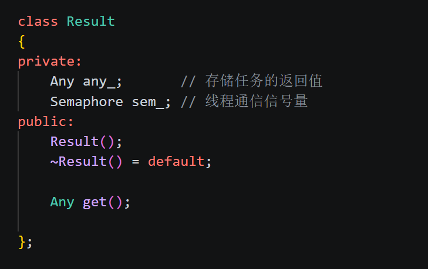
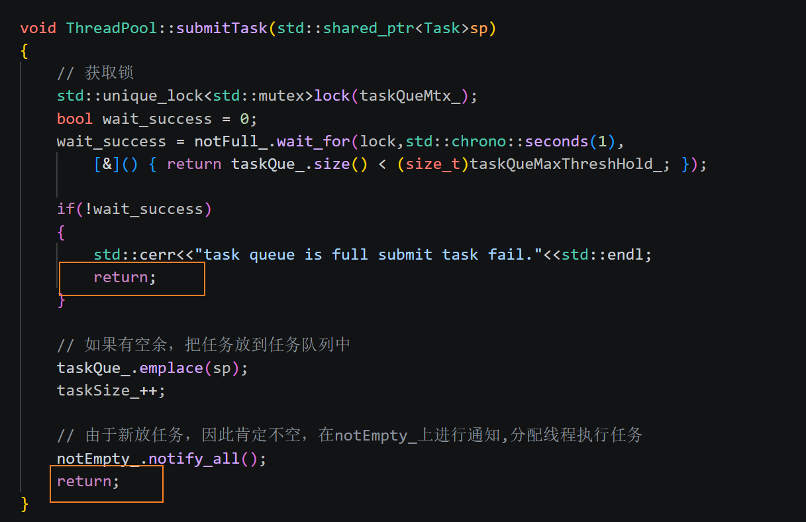
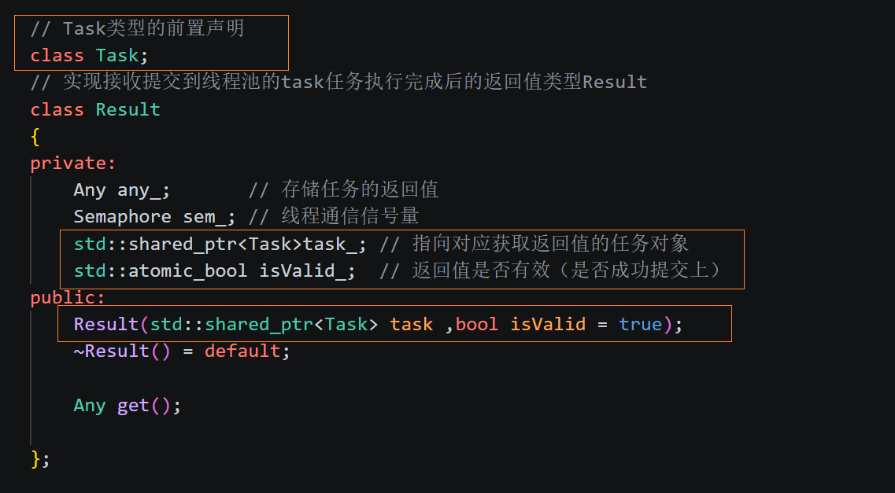
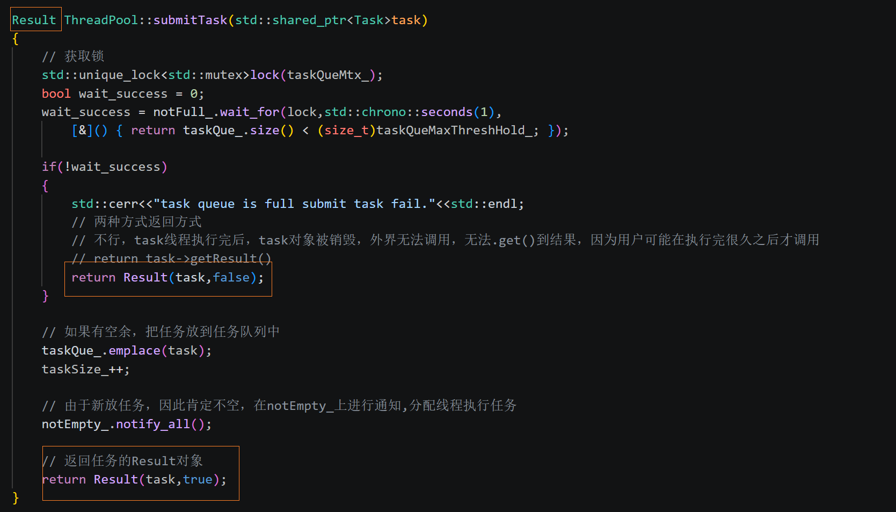
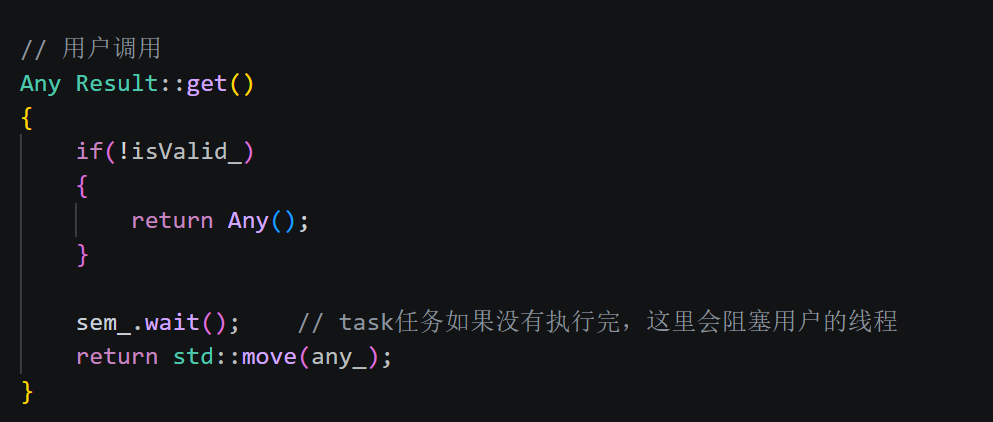
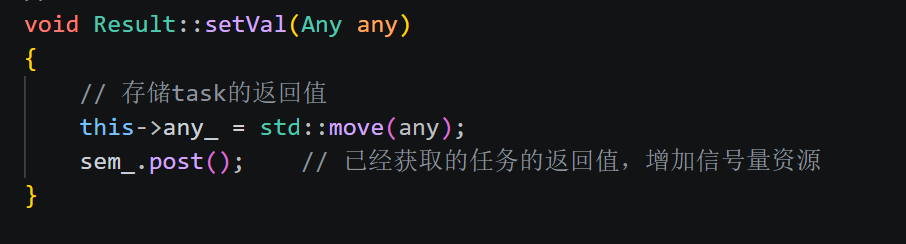
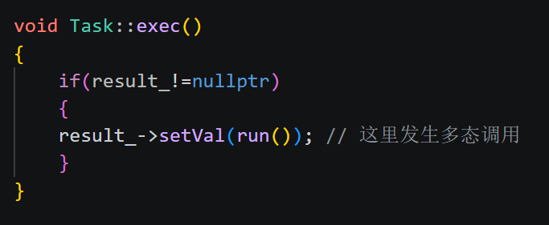
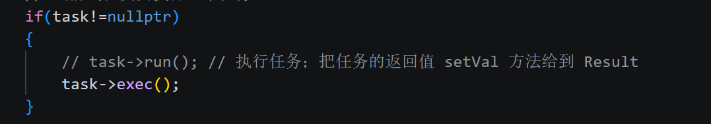
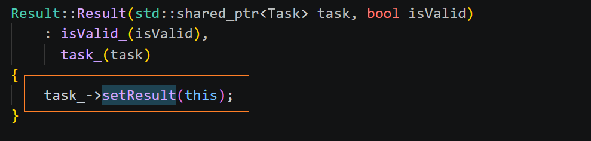

# 实现信号量

本次采用的是信号量semaphore去实现，C++20已经给出了这个类，可以直接调用，但依旧为了练习，我们自己实现这个类，它就相当于是条件变量`condition_variable`的一个升级，将`0->1`变为`0->x`，即变为一个引用计数，所以实现起来依旧利用的是：

* mutex 
* 条件变量

代码如下：
```cpp
class Semaphore
{
private:
    // 类似引用计数
	int resLimit_;
	std::mutex mtx_;
	std::condition_variable cond_;
public:
	Semaphore(int limit = 0)
	: resLimit_(limit)
	{}

	~Semaphore() = default;

	// 获取一个信号量资源
	void wait()
	{
		std::unique_lock<std::mutex> lock(mtx_);
		// 等待信号量有资源，如果没有资源的话，会阻塞当前进程
		cond_.wait(lock,[&]()->bool {return resLimit_ > 0; } );
		resLimit_--;
	}	
	
	// 增加一个信号量资源
	void post()
	{
		std::unique_lock<std::mutex>lock(mtx_);
		resLimit_++;
		cond_.notify_all();
	}

};
```


目前已经实现了两个大类：

* `Any`
* `Semaphore`

现在开始实现`Result`，实现线程池的功能


# 实现Result

### **目的**：

* **实现：接收 提交到线程池的task任务 执行完成后的 返回值类型Result**

## 实现具体过程


1. 首先要把`Any`类作为成员变量，因为要用它来做返回值

2. 其次需要 `get() `成员函数来获取 `Any`拿到的返回值

3. 同样，为了实现完善的`get() `成员函数，我们要加入信号量，即刚刚实现的类 `Semaphore`




4. 到这里，就可以把 `submit()` 的返回值由 `void `改为 `Result`，此时就要修改 `submit`里的 `return `细节这里有两个`return`，一个是提交成功，一个是提交失败的




那到底`return`什么呢？两种方式：

* `Result `属于某一个`Task`   即：`return task->getResult();`
* `Task `隶属于一个`Result`，用`Result`把它包装一下   即：`return Result(task);`

广义上讲，两种没有对错，但结合实际情况，即本线程池的代码架构而言，上面是不合适的，应该使用第二种

理由如下：

要考虑任务的生命周期，因为调用`get()`的时候，任务或许已经执行完了，也就是`Task`对象已经析构掉了，也就是`task`里的`getResult`也已经消失了，用户不会再拿到，因此此处不能把`Result`类放入`Task`中，而是反过来，将任务对象放入`Result`中，方式是直接传入，`Result`内部实现构造函数即可

对于任务提交失败的情况，我们可以直接传入空的`Any`，避免用户调用`get()`时被阻塞（毕竟连提交都没成功）

因此，进入下一步：

5. 将`Task`类作为成员变量 放入`Result`类中，指向对应获取返回值的任务对象
6. 为了区分返回值是否有效（任务提交是否成功），加一个成员变量`atomic_bool isValid_;`，在`submit()`的`return`里添入






7. 接下来，完善两个成员函数：

* `setVal`方法，获取任务执行完的返回值   **任务线程 -> Result**

​			`Task`任务执行完的返回值在虚函数`run()`的返回值中，那如何拿到这个返回值，并存到`Result`对象的`Any`里呢？

* `get()`方法，用户调用这个方法，获取`task`的返回值

​			利用信号量分析有没有返回值，需不需要阻塞	**Result - > 用户**

其中，`get()`方法很容易，直接返回自己类的成员变量即可，返回个`any_`，因为他是统一的接口，用户拿到后强转，然后获取需要的返回值，但是如果直接写`return any_;`会报错，因为`Any`类禁止拷贝构造，而那样写默认是左值，因此要改为右值，即：

`return std::move(any_);`即可

当然，需要先`wait()`到信号才能返回，因为要保证执行完，保证它`Result`类里有值，否则阻塞



但是如何实现`setVal()`方法？它需要接收一个参数`Any()`类，也就是要把`task->run()`的返回值拿到并传进来，如何实现？

同样不能拷贝构造，因此依旧move




8. 现在的问题就是，`setVal()`应该在那里调用呢？

这是要拿任务的返回值，要找到任务执行的地方，任务在哪里执行呢？

`task->run();	// 执行任务；把任务的返回值 setVal 方法给到 Result`

如上在`ThreadFunc()`里，而且这个函数里没有`Result`类对象

那如何操作？

再封装一个函数即可，封装在`exec()`里，不用去修改用户要写的`run()`，封装后如下：

其实可以发现封装的目的是：让`run()`执行的位置从`ThreadFunc()`回到`Task`类里，因为有`Result`类对象，在这里可以调用`setVal`成员函数，然后把这一整套封装为`exec()`，给`ThreadFunc()`去调用，**这又是一个设计思路**





当然不要忘记在`Task`类里设置成员变量`Result`类，注意不能设置为智能指针，因为在`Result`中已经有了`Task`的智能指针，这样会发生智能指针的交叉引用的问题

**循环引用导致内存泄漏的原理分析：**
在使用 std::shared_ptr 时，若两个对象相互持有对方的强引用指针，就会形成**循环引用**。由于 shared_ptr 依靠引用计数来管理生命周期，这种交叉引用会导致各对象的计数器永远无法降为 0，从而引发相互锁定，导致双方都无法触发析构函数。随之而来的后果是内存资源无法被回收，随着任务堆积，内存占用将持续升高，最终导致**内存泄漏**。

因为不必`Result`对象会先于`Task`而析构导致无法调用`setVal()`，原因是Result的生命周期更长，因此此处也不必用智能指针

9. 因为要传入`Result`对象，因此设置`Task::setResult()`成员函数，在`Result`类的构造函数中传入即可




到目前为止，固定模式的线程池已经完结


