# 实现Cached模式的线程池

抛出三个问题：

* 给用户一个方法，可以去设置线程池的工作模式

* 提交任务的时候，依据当前任务数量与空闲线程的数量，去分析是否需要添加新的线程
* 线程池在执行的时候，如何计算线程空闲的时长，空闲过久后如何销毁


## 针对问题一

利用之前设置的成员变量`setMode()`即可完成

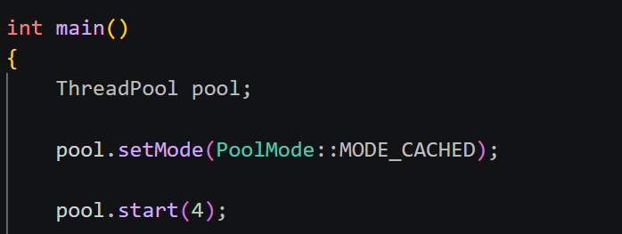

为了让用户更合理的设置线程池的一些条件，应该加一个判断，代表线程池是否已经启动

具体方式很简单，先设置布尔值成员变量`isPoolRunning`，然后添加成员函数用于设置这个变量，

如果已经启动(start)，那就不允许再进行设置，例如：

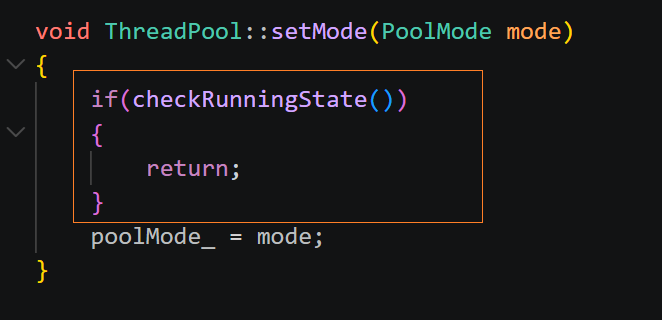

上面那一步很简单，只是加了一个小功能，增强健壮性


## 针对问题二

既然要添加线程，那就需要考虑：

* 为什么添加？

对于小+快+多的任务，需要添加线程来处理，会更高效

* 添加的条件是什么？

当任务数量 > 空闲线程的数量

那就需要计算当前任务数量 、 当前空闲线程数量

增加对应成员变量，然后在适当位置进行加加减减，便可以直接拿到这两个值


* 如何添加？

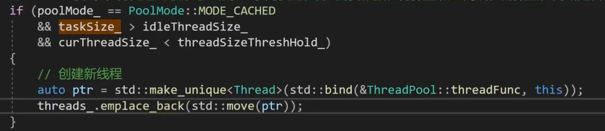


## 针对问题三

删除线程的底线就是至少保留初始线程的数量，就是不能删多了

由于每一个线程对应一个`ThreadFunc`函数，因此在这里动手


那回收线程的条件是什么呢？

针对某个线程，比如：如果60s内没有收到任务，也就是没有wait到，并且总线程数大于初始线程数量，那就应该回收

那现在的问题就是要拿到时间，这里用C++11的时间特性---`chrono` 类


```cpp
// ThreadFunc()
...
// 判断条件
if(poolMode_ == PoolMode::MODE_CACHED)
	{
	// 每一秒钟返回一次 怎么区分:超时返回? 还是有任务待执行返回?
	while(taskQue_.size()==0)
	{
     // 每一秒返回一次 ，如果是超时返回
		if(std::cv_status::timeout == notEmpty_.wait_for(lock,std::chrono::seconds(1)))
		{
            // 计算时间差
			auto now = std::chrono::high_resolution_clock().now();
			auto dur = std::chrono::duration_cast<std::chrono::seconds>(now-lastTime);
            // 如果时间差大于THREAD_MAX_IDLE_TIME，就说明很空闲，应删除
			if(dur.count()>=THREAD_MAX_IDLE_TIME && curThreadSize_ > initThreadSize_)
			{
				// 开始回收当前线程
				// 把线程对象从线程容器中删除  如何匹配:threadFunc 与 thread对象??
				// 借助线程ID,找到线程,删除
				......(如何解决)
			}
		}
	}
}
```


为了解决上面的问题，就应该给每个线程编号

先在线程类里设置一个成员变量`int threadId_;`作为编号

然后设置静态成员变量， 在类外初始化，类似于作为全局变量，不断++，将不同的值赋给不同线程的编号，来区分他们


到这一步，就可以将存储线程的容器由vector修改为unordered_map，更方便管理（删除），即：

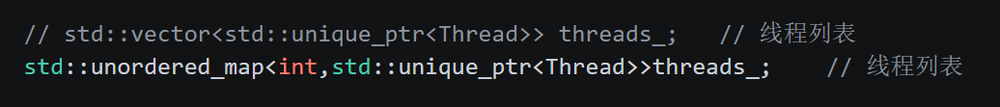


最后，在构建函数`ThreadFunc()`的时候，把 `threadId` 传进来即可（因为删除的时候要使用，要对应编号删除，这是一对一的关系）


上面的每一处改变都是迁一而动全身的，许多地方都是连锁修改，注意即可


# 线程池相关资源的回收

随着主线程pool 离开作用域消失后，线程池应该自动回收，如何优雅的回收呢？

具体修改步骤如下：


1. 首先要在线程池析构函数里将线程状态的成员变量改为false，代表线程结束


2. 要等待线程池所有线程返回后，才能销毁线程池，所有线程有两种状态：
   * 没有任务，在阻塞
   * 正在执行任务中

因此需要一个线程的通信，**信号量**或者**条件变量** 来实现，这里使用条件变量 `exitCond_`来实现，用于等待资源全部回收，添加成员变量条件变量

3. 在析构函数里，重新唤醒所有处理wait的线程，然后再`threadFunc`函数中添加判断，分析是否由析构函数唤醒，如果是的话，就退出线程


# 解决死锁问题(棘手的问题)

## 定位问题

**参考CSDN 大秦坑王，死锁问题的gdb调试**

现在运行main函数，输出如下：
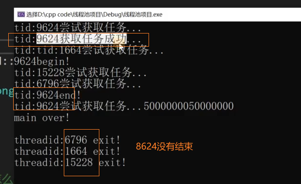

运行任务的程序并没有正常退出程序

此时线程池也没有结束，为什么没有结束呢？

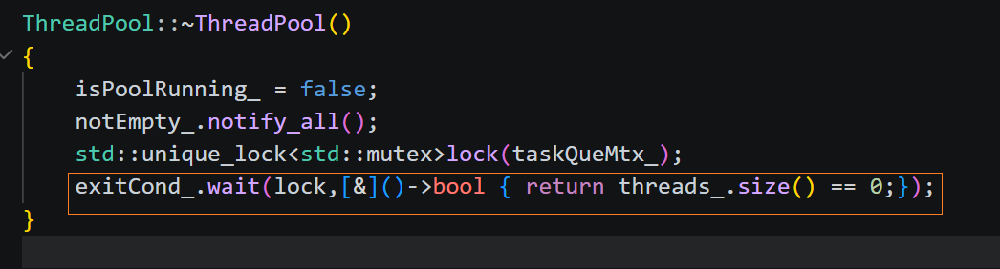

因为还有线程没有正常退出

而且还有一个点，就是该问题不会100%出现，只是概率出现


## 分析问题

我们的逻辑是：线程池里的每一个线程，当线程池退出作用域的时候，即调用析构函数，我们分析线程池里的线程有几种状态？

* 在wait

被析构函数唤醒以后，向下执行会发现，`isPoolRunning`变为了`false`，会执行对应程序，结束当前线程

* 在执行任务

不处于wait状态，析构函数无法直接唤醒，但是他在`while(isPoolRunning)`循环内，我们在循环外直接写了销毁线程，因为跳出循环就代表线程池要被析构了，因此此处也没有问题，，在任务执行完以后的下一次循环直接跳出，进而销毁线程


* "第三种情况"

如果只有以上两种，那没有问题，因为，没问题，但是还有一种情况没有考虑，当`ThreadPool`线程池要析构的时候，我们的线程刚好执行完线程，进入下一层循环，但是又没有进入wait状态

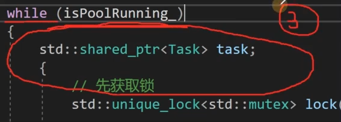


此时，会抢同一把锁`taskQueMtx_`

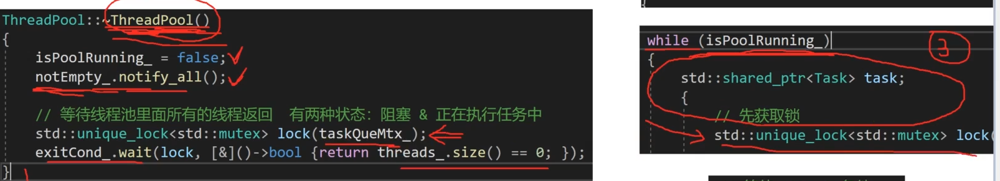


第一种情况，如果pool析构函数线程，先获取锁，那右侧线程池线程就无法获取，先阻塞在获取锁前，当左侧线程运行至wait的时候，会交出锁，但此时已经执行过唤醒了，右侧线程拿到锁会向下执行，一直到wait等待被唤醒，但此时不会再有任务，最后一次唤醒也错过了,那就会一直等，无法销毁，进而使得左侧线程一直等不到线程数量为0而结束，形成死锁，**解决方式就是修改右侧线程wait条件，添加判断isPoolRunning是否为false即可**


第二种情况，如果右侧线程池线程先拿到锁，拿到锁以后，发现任务队列没有任务，那就继续wait等待，而此时已经不会再收到析构函数的唤醒（因为已经唤醒过了）那该线程就会永远睡死在这里，依旧无法退出该线程，依旧导致线程不为0，即左侧一直等待，即死锁发生

**解决方式就是把左侧唤醒线程放入锁的内部**

以上是非常隐晦的bug，很难挖掘，很易发生，很有价值（gemini无法一眼看出）


## 解决问题

将：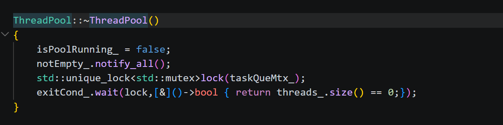

改为：

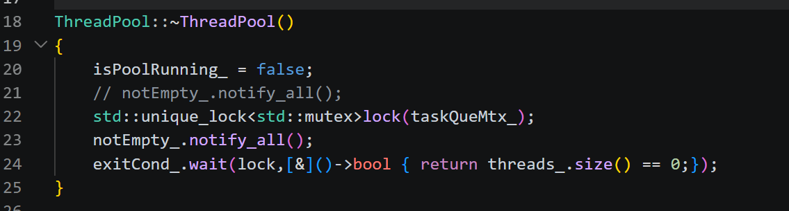


修改后，同样考虑第三种情景发生的抢锁的两种可能：

* 如果线程池里的线程先拿到锁

  它会执行到wait，然后把锁交出去，此时pool析构函数拿到锁后第一时间唤醒线程池的线程，它会继续向下执行，会发现`isPoolRunning`变为false，进而销毁线程，不会卡着线程数量最后不为0导致pool析构线程永远无法结束，解决死锁


* 如果pool析构函数线程，发现与修改前一致，无影响，依旧死锁，那再怎么修改？

  当析构函数运行到wait的时候，会交出锁，这时候线程会向下执行，我们只需要加一个条件判断，看看`isPoolRunning`是否为`false`即可，如果是的话，当场销毁

  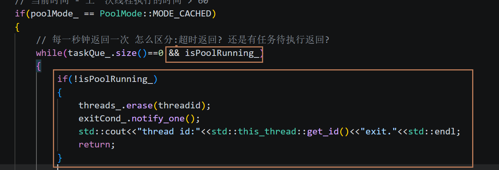

  


# 结余

C++11用于训练自己的线程池已经完成，有很多小问题会修改，比如排版，就不记录笔记，之后会再发一个现代线程池，不再手动实现Any等问题
